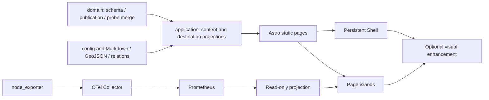

# 实现结构与收口

用户批准的产品优先级为 PRD、架构、程序设计，HTML 只提供首屏内容与视觉气质。
原始合同保存在 reference；本页记录已落实的差异，不修改原始文件。

## 依赖与模块

domain 不依赖浏览器、Astro 或服务；application 适配 Astro Content Collections。
页面输出语义 DOM，client 只增强；图谱、地图、粒子均不修改内容事实。
没有 React、UI 套件、图数据库、自研 renderer 或外部日志服务。

## 合同补齐

- 暖纸之间安静交换；终端到暖纸单张纸；终端之间按标题/边框 cohort 直接迁移。轮廓采样由原生 Canvas 2D 完成，点的渲染全由 tsParticles 执行，不调用私有 API。
- 首屏五个独立模块仅加载当前选中项。`?effect=` 固定效果类型；无参数刷新随机。没有八秒强制跳转。
- 主题只改变明暗，不改变语言家族。系统 reduced-motion 优先，手动设置只能降低动效。
- 标签聚合使用 Pagefind 分类/标签筛选；空分类不生成页面；草稿不参与任何公开投影。
- 关系两端是文章 slug；`definite` 才公开，未知引用使构建失败。
- 图片从 Markdown 的本地图片构建 AVIF/WebP，真实 img 保留尺寸与 lazy 属性。
- Giscus、工具域名、电台源从环境注入。电台生成文件在 Git 忽略列表，浏览器仍可看到播放所需 URL。
- 工具和实验都由 config 登记；本地 HTML 与依赖资源构建到独立 origin，主域只有索引。
- 公共探针只输出固定字段，CPU/内存/Swap/磁盘百分比，负载原值。各台独立维护 stale，不能因一台失败冻结其他机器。
- 本地 Docker 展示一台真实容器指标，不伪造 4–5 台生产主机。

## 当前 API 核对

- [Astro ClientRouter 生命周期与持久节点](https://docs.astro.build/en/guides/view-transitions/)
- [tsParticles 官方文档](https://particles.js.org/docs/)：当前 v4 显式点通过公开 `particles.addParticle`，颜色使用 `paint.color`。
- Pagefind 构建实际输出 Extended / zh-CN，仅索引文章。

## 真实环境边界

真实主机、GitHub/Giscus、电台地址与生产域名尚未提供。功能可配置，但本地验收不声称这些真实外部服务已连通。
模板分支移除演示文章、摄影、旅行记录、服务器名单和个人文档；保持同一代码架构。
