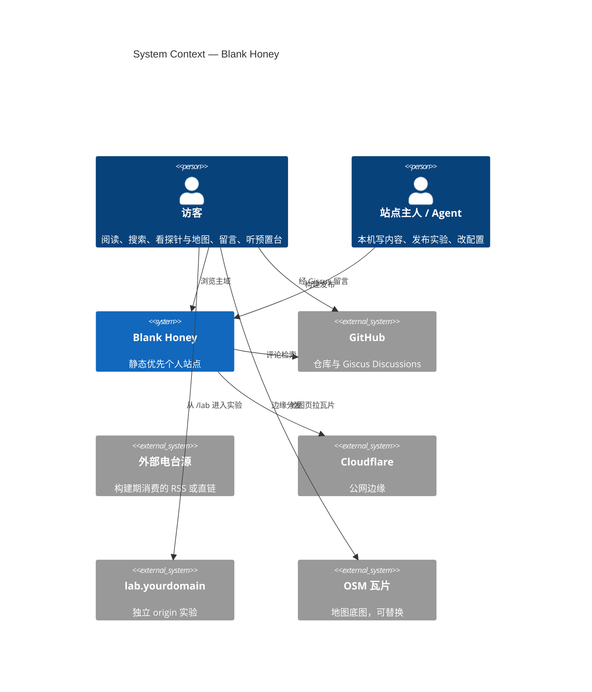
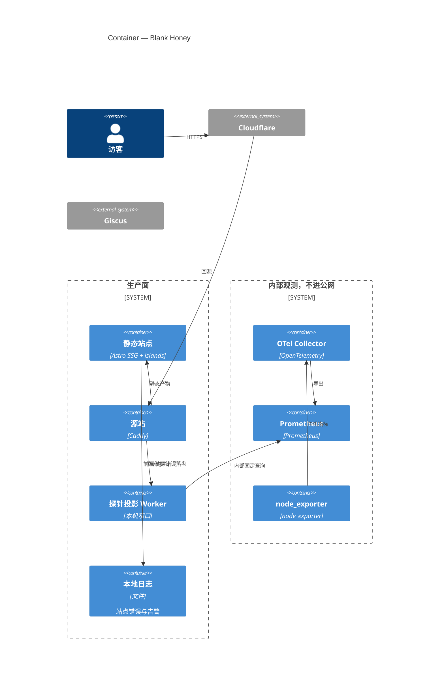
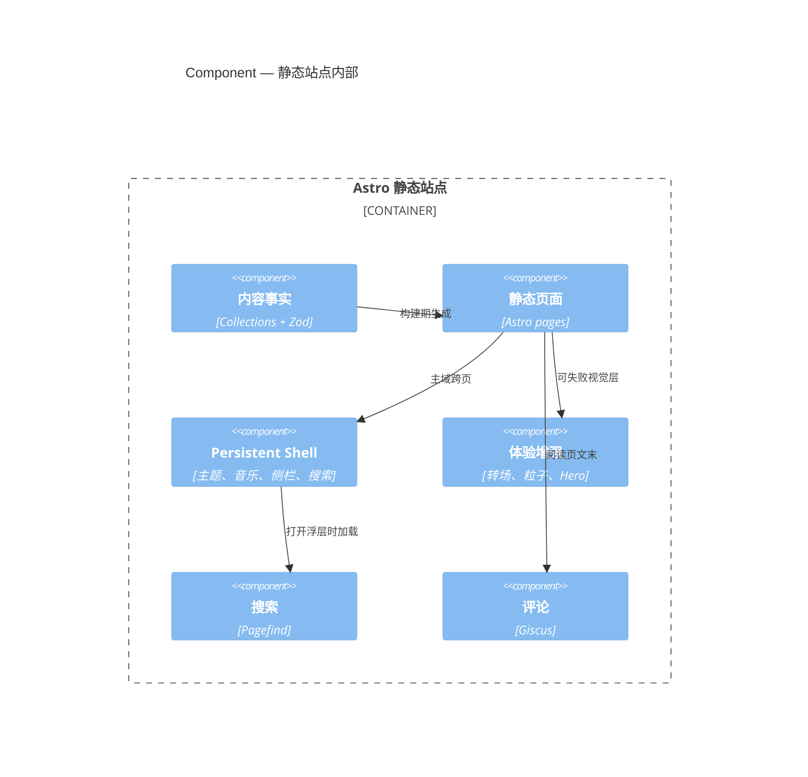

# Blank Honey 最终施工前架构文档

- 版本：v1.4
- 日期：2026-09-12
- 基线：PRD v1.3 + 架构 v1.3 + 本轮程序设计前收口
- 优先级：PRD 产品范围 ＞ 本架构 ＞ HTML 原型实现细节
- 本文不写接口字段、目录树、施工步骤。这些属于程序设计文档。

站点五层：**内容事实层 → 静态表现层 → Persistent Shell → 体验增强层 → 运行与观测层**。增强层可以失败，失败不得破坏路由和正文。

---

## 0. 相对 v1.3 的新增收口

| 议题 | 架构行为 |
|---|---|
| 站点错误日志 | 只写服务器本地日志，restic 一起备份。不接 Sentry 或其他 SaaS |
| 电台源 | 构建期解析 RSS / 登记直链。浏览器只用构建结果。访客不能加台 |
| 搜索浮层语言 | 跟随当前页：暖纸页上暖纸浮层，终端页上终端浮层 |
| 搜索结果 | 可带匹配高亮摘要，做法跟 Pagefind 常见集成走 |
| 阅读页返回 | 固定回到 `/articles/`，不跟浏览器历史 |
| 回看首屏 | 文章选择页页脚一条极淡文字链，不进主导航 |
| 地图底图 | 第一版 OSM 公共瓦片；瓦片提供者必须可替换，不写进内容事实 |
| Giscus 仓库 | 站长自己的公开 GitHub 仓库 |
| 公开统计面板 | 第一版不做 |
| `?effect=` | 架构必须支持按参数复现 Hero |
| 简言池 | 产品配置里的候选池，构建或运行时抽取 |

v1.3 已冻结且本版不改的：Astro SSG + islands、Collections + Zod、只读探针投影、覆盖式右侧侧栏、两套视觉语言、粒子直接 morph、独立图谱页、分类分块与归档、Giscus pathname + Announcements + strict、lab 独立 origin、MIT + template 分支、不自研粒子引擎 / WebGL。

---

## 1. 冻结边界

HTML 原型只保留气质：暖纸与终端、黑洞点入口、功能页粒子是表现层、翻纸要像一张纸。

原型不升级为架构的：粒子先散开再聚、自研 WebGL、侧栏螺旋、侧栏推动正文。

「3D 粒子」= 纵深观感，不是可旋转真三维场景。生产粒子只用 tsParticles slim + Emitters。

---

## 2. C4

### Context

### Container

### 主站组件

依赖方向：**内容事实 ← 静态页面 ← Shell / 增强 / 功能投影**。功能页、粒子、图谱、地图、搜索都不得反写 canonical。

---

## 3. 页面生命周期

主入口：Hero → 文章选择 → 侧栏打开后的功能页。

深链接不重播 Hero。Hero 彼此独立懒加载，不与功能页粒子共享实例。

`?effect=` 只影响 Hero 选择，不改变后续路由。

路由成功与动效成功拆开。动画失败或 `prefers-reduced-motion` 时目标页直接出现。

进入实验 origin 是边界事件：音乐可中断，壳层可不继承。

---

## 4. 视觉与转场

| 语言 | 页面 | 字体 | 色 |
|---|---|---|---|
| 暖纸 | 选择、归档、阅读 | Newsreader + Source Han Serif CN | `#F4EBDD` `#2B2723` `#7A5138` |
| 终端 | 探针、地图、图谱、工具、实验室索引、404 | Terminus/VT323 + Source Code Pro / CJK mono | `#0B0D0E` `#D6D7D2` `#9AA68C` `#B6A27A` |

阅读列约 18px / 行高 1.7–1.75 / 宽约 690px。Hero 不继承这两套。功能页禁止霓虹、扫描线、故障、毛玻璃、渐变底。

主题：手动 ＞ 当地时间自动 ＞ `prefers-color-scheme`。减少动效独立。

| 变化 | 行为 |
|---|---|
| Hero → 暖纸 | Hero 退场后进选择页 |
| 暖纸 → 暖纸 | 安静交换 |
| 终端 → 终端 | 粒子直接位移 morph |
| 终端 → 暖纸 | 单张舒缓翻纸 |
| 暖纸 → 终端 | 四周粒子覆盖 |
| 去 lab origin | 正常跨 origin |
| reduced-motion / 失败 | 直接 swap |

纸是视觉层，不是路由容器。StPageFlip 只作对照。功能页禁止「散开再聚」。DOM 是语义真相，粒子 `pointer-events: none`。

能力档：full / light / reduced-motion。

---

## 5. Shell 与导航

主域跨页保持：主题、音乐、侧栏开合、搜索开合。

收起：与当前语言协调的纯色小点。

打开：右侧覆盖浮层，不改正文几何。搜索在顶部，功能菜单在下。浮层语言跟随当前页。搜索结果在浮层内展开并可带高亮摘要。

阅读页常驻只有：返回到 `/articles/`、侧栏小点。目录默认折叠。

文章选择页页脚：极淡「回看首屏」，链到 `/`。

功能菜单：文章、探针、地图、图谱、工具、实验室。搜索不编号。

---

## 6. 内容与功能

Canonical 只有 BlogPosting。分类一等公民，标签细粒度。地点与关系独立。空分类不生成归档。

选择页按 registry 顺序分块，每块最近 3–4 篇。分类标题进 `/category/<slug>/`。

阅读结构：返回 + 小点 → 标题（标签悬停）→ 元数据 → 可折叠目录 → 正文 → 上一篇/下一篇 → Giscus。

Giscus：pathname + Announcements + strict；仓库是站长自己的 repo；配置不进公共 Git。

搜索：Pagefind；只索引文章；中文用 extended 分词。

地图：Leaflet + 本地 GeoJSON 表达事实；底图瓦片默认 OSM，通过配置替换提供者。缩放阈值显隐地点与地标。MapLibre/PMTiles 仍是未来边界。

图谱：独立页，Cytoscape 懒加载，只读 definite relations。

工具：外链卡片。实验室：`/lab` 索引 + 独立 origin。

音乐：配置清单可空；构建期解析源；主域 persistent；`waiting-for-click` 是正常态。

RSS / sitemap 上线即有。博客 RSS 不含探针、地图、电台。

404 走终端，提供回 `/articles/` 或 `/`。

---

## 7. 观测、日志、配置

探针数据流：

**node_exporter → OTel / Prometheus → 只读投影 Worker → Caddy 窄口 → 探针页**

浏览器只拿：在线、CPU、内存、Swap、磁盘、负载、展示用地区与时区。Swap 未配置 ≠ 采集失败。

站点错误、构建失败、播放失败、探针告警写入**本机日志文件**。不接第三方 APM。日志随 restic 备份。

配置两个入口：`src/config.ts`、`.env.example`。Giscus、服务器地址、电台 URL、密钥不进公共仓库。

「不进 Git」不等于「浏览器看不到」。没有前台必要的真实主机地址不得出现在探针 JSON。

---

## 8. 部署、开源、自研

Git + Caddy + Cloudflare + restic。不上 K8s。

主仓 MIT。文章 / 照片 / 实验各自版权。template 分支去个人化，不得长出第二套架构。

| 自研 | 不自研 |
|---|---|
| 视觉 token、转场编排、单张纸、品牌粒子 preset、粒子迁移编排、侧栏滑出、阅读图占位、Hero 编排、分类信息架构、窄投影 Worker、本地错误日志格式 | 粒子引擎、WebGL、路由、Pagefind、Giscus、Leaflet、Cytoscape、字体、node_exporter、代码复制组件 |

禁止：功能页爆炸重聚、暴露 Prometheus、自研远端 agent、图数据库、预铺 PMTiles、lab 共享主域权限、把 secret 提交仓库、StPageFlip 当路由、K8s、第一版最热与公开统计面板。

---

## 9. 给程序设计的输入

程序设计必须带 C4 + Mermaid，并落实：

- 路由模式与阅读页返回 `/articles/`
- `?effect=` 与简言池
- 选择页页脚回看首屏
- 浮层跟随页面语言
- OSM 可替换瓦片
- 构建期电台解析
- 本地错误日志，无 SaaS
- 探针实时投影
- 终端 morph 不得碰 tsParticles 私有内部

程序设计可以写模块名、状态名、逻辑字段、路由，不得打开本文未打开的产品面。
