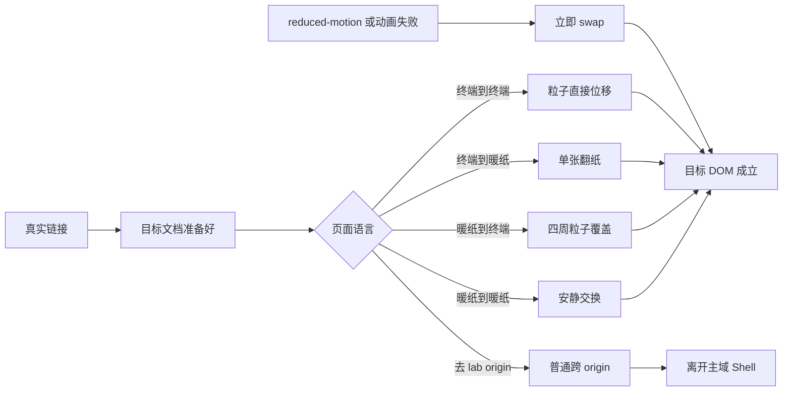

# Blank Honey 最终程序设计文档

- 版本：v1.1
- 日期：2026-09-12
- 输入：PRD v1.3、架构 v1.4
- 定位：施工合同。不重新投票产品，不把 HTML 原型当生产实现。
- 施工时只允许改官方 API 的包名 / 函数名 / 当前稳定版本，不允许借机换栈。

---

## 1. 文档定位

把冻结决定收成模块、状态、路由、数据流、失败路径和验收句。编码 Agent 按此一次施工。

未改变的冻结项见 PRD / 架构。本版相对 Deep Research 程序设计稿只补齐本轮问答：

- 站点错误写本地日志，不接 Sentry
- 电台构建期解析，浏览器只用产物
- 搜索浮层跟随当前页语言
- 搜索结果可带高亮摘要
- 阅读页返回固定 `/articles/`
- 选择页页脚「回看首屏」
- 地图底图 OSM，提供者可替换
- Giscus 用站长自己的仓库
- 公开统计面板不做

---

## 2. C4 与分解

架构 v1.4 第 2 节的 Context / Container / Component 图是本设计的结构图，施工时原样放入仓库文档即可。下面补生命周期与部署。

依赖方向：

**内容事实 → 构建期投影 → 静态页面 → Persistent Shell / 页面 islands → 可失败视觉增强**

旁路：**node_exporter → OTel Collector → Prometheus → Projection Worker → Probe Island**

反向写 canonical 一律视为越界。

---

## 3. 模块

| 模块 | 做什么 | 不做 | 失败后 |
|---|---|---|---|
| ContentFacts | 校验文章、分类、标签、地点、relations | 不持有运行状态 | 构建失败 |
| ContentProjection | 分块、归档、TOC、prev/next、地图/图谱/搜索投影、电台构建结果 | 不改 canonical | 构建失败 |
| StaticPageComposer | 生成所有语义页面 | 不持有播放器 | 静态 DOM 仍在 |
| PersistentShell | 主题、音乐、侧栏、搜索跨主域保持 | 不管 lab origin | 真链接仍能走 |
| ThemeController | 手动 > 当地时间 > 系统；同步 Giscus | 不改页面语言家族 | 安全默认 |
| AudioController | 预置台、自动播放、waiting-for-click | 不代理媒体、不让访客加台 | 只该台 error |
| NavigationOverlay | 右侧覆盖浮层，语言跟随当前页 | 不推正文、不螺旋 | 瞬时开关 |
| SearchAdapter | Pagefind + 高亮摘要 + 分类标签筛选 | 不建搜索服务 | 「搜索暂不可用」 |
| TransitionOrchestrator | 按语言×能力选转场 | 不阻塞路由 | 直接 swap |
| ParticleSurface | 覆盖与 morph | 不生成语义、不写 renderer | DOM 终端页仍可用 |
| PaperTurnLayer | 一张舒缓纸 | 不当路由 | 直接到暖纸页 |
| HeroEffectHost | 随机或 `?effect=` 懒加载一个效果 | 不与功能页粒子共实例 | 静态字 + 可进选择页 |
| ProbeIsland | 固定投影、10s 刷新、stale | 不发 PromQL | 最后好值 + stale |
| ProjectionWorker | 内部固定查询压成公共字段 | 不当通用网关 | unavailable，不回显内部错 |
| MapIsland | Leaflet + 本地 GeoJSON + 可替换瓦片 | 不写地点 | 地点文本列表 |
| GraphIsland | Cytoscape 只读关系 | 不推断、不写回 | 关系文本列表 |
| ArticleEnhancements | TOC、复制、图片、Giscus | 不改正文语义 | 正文完整 |
| SiteLog | 前端/构建/播放/探针告警落本地文件 | 不接 SaaS、不做画像 | 主站仍可访问 |

Shell 初始化必须幂等。页面 island 必须挂载即清理。

---

## 4. 路由

| 路由 | 语言 | 焦点 | 常驻 | 进出 |
|---|---|---|---|---|
| `/` | Hero | 名字 + 一个效果 + 简言 | 效果选择可收 | → `/articles/` |
| `/articles/` | 暖纸 | 分类分块 | 小点；页脚回看首屏 | → 文章 / 归档 / 功能页 / `/` |
| `/category/[slug]/` | 暖纸 | 该分类时间线 | 返回选择页、小点 | → 文章 |
| `/blog/[slug]/` | 暖纸 | 阅读列 | **仅返回 `/articles/` + 小点** | → 相邻文章或选择页 |
| `/probe/` | 终端 | 主机卡片与百分比 | 小点 | 侧栏 |
| `/map/` | 终端 | 地图 | 小点 | 侧栏 |
| `/graph/` | 终端 | 关系图 | 小点 | 侧栏 |
| `/tools/` | 终端 | 外链卡 | 小点 | 外链或侧栏 |
| `/lab/` | 终端 | 实验索引 | 主域 Shell | → 实验 origin |
| `lab.yourdomain/...` | 实验自有 | 作品 | 不要求 Shell | 跨 origin 回 `/lab/` |
| 搜索浮层 | 跟随当前页 | 顶部搜索 + 高亮结果 | 非独立路由 | 点结果进文章并收起浮层 |
| 404 | 终端 | 错误 + 回站 | 小点可用 | → `/articles/` 或 `/` |

每个主域路由构建时标记 `hero | paper | terminal`。转场只读这个标记。

Hero：`/` 默认随机；`/?effect=<id>` 固定该效果。刷新无参数则重新随机。

---

## 5. 内容生成

文章类型只有 BlogPosting。另有分类 registry、地点、relations。标签从文章去重进搜索 filter。坏引用视为构建错误。

选择页：排除 draft；按 registry 顺序；每块日期倒序最多 4 篇；slug 作平局。空分类不出现、不生成归档。直接访问空 slug → 404。

阅读 TOC：只取 H2/H3；没有则控件消失；默认折叠。

上一篇 = 同分类较新；下一篇 = 同分类较旧；该方向没有则回退全站时间线。界面写明较新 / 较旧。草稿不参与。

代码块用 astro-expressive-code 自带复制。

图片：真实 img/picture，构建期 AVIF/WebP，lazy，可有模糊占位。

JSON-LD：BlogPosting。RSS 只含文章。sitemap 含公共页。

简言从 `src/config.ts` 候选池抽，Hero 用。agent 改配置即追加。

---

## 6. 壳层

状态：

- Overlay：`closed` / `open` / `search-expanded`
- Theme preference：`auto` / 手动 light / 手动 dark
- Audio：`empty` / `idle` / `loading` / `playing` / `paused` / `waiting-for-click` / `error`
- Capability：`full` / `light` / `reduced-motion`

关闭时只见小点。打开从右侧覆盖滑入。搜索在顶部，结果在面板内滚，正文几何不变。

浮层 token 跟当前页家族走，明暗跟 ThemeController 走。

Escape 关闭。焦点：关闭回小点，搜索展开进输入框。点搜索结果后收起浮层。连续开关取消旧动画从当前姿态继续。

自动主题：本地 07:00–18:59 light，其余 dark；跨过阈值或标签页重新可见时重算。只改明暗，不改暖纸/终端。

阅读页不常驻播放器面板。音乐控件在浮层里。

---

## 7. 转场

| 当前→目标 | full | light | reduced / 失败 |
|---|---|---|---|
| Hero→暖纸 | Hero 退场 | 简化 fade | 直接进 |
| 暖纸→暖纸 | 安静换页 | 更短 | swap |
| 暖纸→终端 | 四周覆盖 | 少粒子 | swap |
| 终端→暖纸 | 单张舒缓纸 | 浅透视 | swap |
| 终端→终端 | cohort 直接迁 | 短位移 | swap |
| 去 lab | 跨 origin | 同左 | 同左 |

翻纸必须经过抬起—纸背—折痕—落下。禁止 180° 快甩。StPageFlip 不进依赖。

终端 morph 配对：标题、主框、横栏、进度、关键数字。对不上的沿最近目标淡出，禁止向四周炸。只用 tsParticles 公开 API + 编排。做不到一对一点就 cohort 近似，不许碰 internals，不许写 WebGL。

「3D」只用大小、透明、轻微 blur、速度差。canvas 不接收点击。

最新导航胜出。不倒放已销毁的 canvas。

---

## 8. 功能页

### 探针

公共 GET 唯一产品口。字段：

`publicId, displayName, online, sampledAt, regionLabel, timeZone, cpuPercent, memoryPercent, swapPercent, swapState, diskPercent, load1, load5, load15, status`

`swapState`：`available | not-configured | unavailable`。

可见时 10 秒拉一次；隐藏暂停；回来立即拉。连续两轮无新采样标 stale。只有内部确认 down 才 offline。Worker 短缓存固定视图。真实 IP/hostname/PromQL 不进 JSON。

UI 用百分比条，不是只甩数字。

### 地图

Leaflet 稳定 1.9.x 语义，不追 2.0 alpha。事实来自本地 GeoJSON。

底图默认 OSM 公共瓦片，提供者写在配置，换成别家只改配置。内容层不依赖某一家瓦片才能表达「去过 / 没去过」。

Zoom 0–2 轮廓；3–4 地点；≥5 地标。用 LayerGroup 开关。失败时留文本地点列表。

### 图谱

`/graph/` 才加载 Cytoscape。离开销毁。只渲染 definite relations。点击最多跳已有文章。reduced-motion 不做入场动画。

### 工具 / 实验室

工具只做外链卡。`/lab/` 仍在主域 Shell。进实验 origin 不保音乐。无公网上传。

---

## 9. 搜索、评论、音乐、日志

Pagefind extended，`lang=zh-CN`。只索引文章。分类/标签当 filter。首次聚焦再加载。结果展示标题 + 高亮片段，点进文章。

Giscus：pathname + Announcements + strict；仓库=站长自己的 repo；文末；主题用 `setConfig` 同步，不重建 iframe。身份放环境变量。

电台：`src/config.ts` 逻辑清单 + 环境里的真实 URL。构建期解析 RSS enclosure 或登记直链。解析失败只标该台 unavailable，默认不挡全站构建。空清单则隐藏播放器，不报错。访客不能提交新台。

自动播放：`idle → attempting-autoplay → playing`；被拦则 `waiting-for-click`；用户暂停后普通点击不再偷偷续播。

站点日志：浏览器可上报错误摘要到本机窄口（只接受本站 origin、有限字段、限流），Caddy 或小服务写入日志文件。构建失败写 CI/本机构建日志。探针告警写同一日志目录。不接 Sentry。不存用户画像。日志进 restic。

---

## 10. 配置、部署、开源

`src/config.ts`：可公开常量、导航、Hero registry、简言池、电台逻辑项、瓦片提供者键、功能开关。

`.env.example`：变量名和占位。生产值不进 Git。

浏览器需要的 Giscus id、可播地址在构建时注入，仍可能被看到。Prometheus 地址、真实主机、内部 label 只留服务器。

Caddy：静态站 + 仅 `/api/probe`（及如需的本站错误上报窄口）。没有 Prometheus 反代。

部署：Git + Caddy + Cloudflare + restic。发文后尽快让 HTML 可见（短缓存或 purge），细节按 Cloudflare 免费层在施工时选。

开源：代码 MIT；文章/照片/实验各标版权。template 去掉域名、Giscus、分析、服务器名单、真实电台、个人内容。

restic：私有环境、Caddy/OTel/Prometheus/Worker 配置、不在主仓的 lab 产物、日志。不备份可重建的 dist、Pagefind 索引、node_modules、Prometheus 历史 TSDB（第一版探针无历史图）。

---

## 11. 自研预算

用现成：Astro 7.x 当前稳定、Collections+Zod、ClientRouter persist、Pagefind、Giscus、Leaflet 1.9.x、Cytoscape 3.x、astro-expressive-code、node_exporter、OTel Collector、Prometheus、Caddy、tsParticles slim+Emitters。

允许自研：品牌 token、转场决策、单张纸、粒子 preset、morph 编排、浮层节奏、主题规则、电台适配、图片占位、投影 Worker、本地日志格式、Hero 产品编排。

禁止：WebGL renderer、自研粒子引擎、图数据库、搜索服务、K8s、自研远端 agent、StPageFlip 进运行栈。

版本号以施工当日官方稳定版为准，本文提到的发行号只是调研时点，不锁包。

---

## 12. 验收句

- `/` 只初始化一个 Hero；无参数刷新再随机；`?effect=` 可复现；效果失败仍能看到名字并进选择页
- 选择页暖纸、分类分块、每块最多 4 篇、无最热；页脚有淡「回看首屏」
- 分类归档只含该分类；空分类 404；不进主导航
- 阅读页常驻只有返回到 `/articles/` 和小点；目录默认折叠；prev/next 在 Giscus 前；代码可复制
- 搜索浮层语言跟当前页；结果可高亮；正文不被推走
- 侧栏右侧覆盖，无螺旋、无推移
- 探针含 Swap；百分比条；公网看不到 Prom/主机地址
- 地图 OSM 可换；缩放才出地点/地标
- 图谱独立页，离开销毁，无推断边
- 空电台不报错；访客加不了台；被拦进 waiting-for-click
- 终端页粒子直接迁，无炸开空场
- 关 canvas 后标题数字链接仍可点
- reduced-motion 直接替换，功能不丢
- 错误能在服务器日志里找到，不经过第三方 APM
- template 克隆看不到个人基础设施

---

## 13. 施工时只再核对的 API

Astro Content Layer 与 ClientRouter 事件、Pagefind bundle 路径、Giscus setConfig、tsParticles 公开 emitter API、View Transition 伪元 WAAPI、Leaflet 是否仍应停在 1.9、Cytoscape destroy、OTel/Prometheus 组件稳定级、Caddy matcher、Expressive Code 选项、Astro 图片与 RSS API。

只许修正签名和版本，不许换产品决定。
