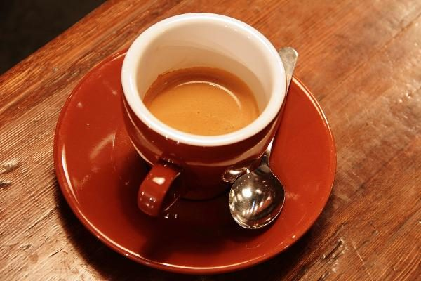

把电脑合上，把一杯咖啡喝完。剩下的时间，不必急着命名。

下午两点多，雨开始落下来。不是那种急着把人赶进屋的雨，而是细细的、没有什么方向的雨。我坐在靠窗的位置，杯子底下垫着一张已经卷了边的纸。原本打算在这里改完一段代码，后来只是把电脑合上了。

有一段时间，我很难忍受这样的下午。没有完成的清单，没有可以展示的结果，连一张值得发出去的照片也没有。一天过得是否充实，好像必须由某种产出来证明。可越是这样想，就越容易把每一个空隙也安排好。

桌上的咖啡比我记忆里更苦一点。我没有急着加糖。店里有人把椅子往后挪，瓷器轻轻碰在一起，门打开时风带进来一小片潮湿。那些平时会被耳机挡住的声音，此刻都恰好落在自己的位置。

## 不把每一刻都变成结果

我把笔记本翻到新的一页，只写了一句：今天不需要总结。写完反而笑了，连不总结这件事，也被我认真记了下来。也许习惯不是一下子改掉的，它只是偶尔松一松，让别的东西透进来。

窗外有一个人撑着很大的伞，却仍然沿着屋檐走。快递车停了一会儿，又往前挪了几米。一只小狗对水洼有着远比我更具体的兴趣。这个下午没有等我加入，也照样完整地发生。

> 留白不是少了什么。是给正在发生的事，留一个位置。

以前做网站，总想着首页还能放点什么。动态、统计、收藏、最近正在听的歌。每样东西单独看都说得过去，放在一起却像一张贴满便签的桌子，找不到一处能安心放下手。

后来才慢慢觉得，写下一篇文章，最重要的或许不是把入口做得醒目，而是让人点进来以后，能忘记自己正在使用一个网站。文字是文字，图片有自己的空间，读到一半也不会有什么东西突然要求回应。

## 有一些东西，慢一点才看得见

咖啡放凉的时候，雨还没有停。我把本子上的那一页留了下来，没有撕掉，也没有再补一个漂亮的结尾。店员来收杯子，我说再坐一会儿。她点了点头，像是这本来就是一件不用解释的事。

回家的路上，我绕去了河边。水面很平，有一块落叶顺着岸走了很远。我没有拍照。只是记得，那一小段路上，我终于没有一边走，一边想着下一件事。

这就是这个下午留下的全部。并不多，但也足够。
