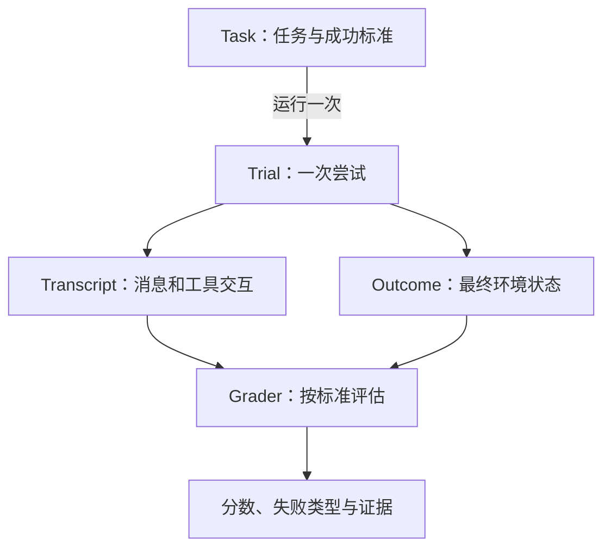

Agent 可能完成一连串工具调用，最后却没有把系统改到正确状态。也可能回答听起来不够漂亮，但环境里的目标已经实现。整理评测笔记时，我把“做了什么”和“最后变成什么”分开，后面的指标才有明确对象。

## 一次任务可以运行很多次

Anthropic 的 [Agent 评测说明](https://www.anthropic.com/engineering/demystifying-evals-for-ai-agents)给出了几个有用的名称：task 是一个待测任务，trial 是对它的一次尝试；grader 按标准评分；transcript 记录执行过程，outcome 表示最终环境结果。

这几个词可以放进同一张图里。评分同时可以读取轨迹与结果，不必只看最终回答。

查看 Mermaid 源码

例如测试一个修改数据的任务，轨迹可以说明用了哪些工具；结果检查则应读回数据，确认实际状态。

## 至少成功一次，和每次都成功

笔记将 `pass@k` 简写成“一次成功率”，容易误读。准确地说，`pass@k` 关注 k 次尝试中至少一次成功，`pass^k` 关注 k 次全部成功。前者适合有重试空间的任务，后者更接近稳定性要求，不能拿一个替代另一个。[定义来源](https://www.anthropic.com/engineering/demystifying-evals-for-ai-agents)

举个纯计算例子：假设每次成功率为 0.8，且尝试相互独立，三次至少成功一次的概率是 `1 - (1 - 0.8)^3 = 0.992`，三次全部成功的概率是 `0.8^3 = 0.512`。两种数字差得很大。真实 Agent 的运行未必独立，因此这个算例只能解释指标的差异，不能代替实际统计。

## 新能力和旧能力用不同的问题检查

能力评测和回归评测回答不同的问题。前一组用来寻找当前做不到的任务，后一组保护已经能做的事情。把所有题目放成一个平均分，会掩盖“新任务进步、旧任务退步”的情况。

评分手段也可以组合：代码检查适合有明确可执行条件的部分；模型评分可以处理开放文本，但需要清楚的标准；人工检查有助于发现题面歧义、错误参考答案和评分盲点。使用哪一种，都应保留可回看的失败实例。

笔记列出的任务包括编码、对话、研究和计算机操作。它们的验收对象不同。研究任务尤其需要说明引用和结论各自怎样核对；只给最终文字打分，容易漏掉搜索过程中的错误。

## 先读一些失败轨迹，再增加指标

维护评测时，先读一些失败轨迹。如果失败集中在任务描述不清，继续增加运行次数不会让题目变好；如果工具返回就错了，修改最终答案评分也抓不到根因。

还需要留意代理是否在迎合评分器。任务分数提高后，可以抽样检查实际成果，并观察留出的任务有没有同步改善。这样才能发现“检查项全通过，用户问题仍没解决”的情况。
