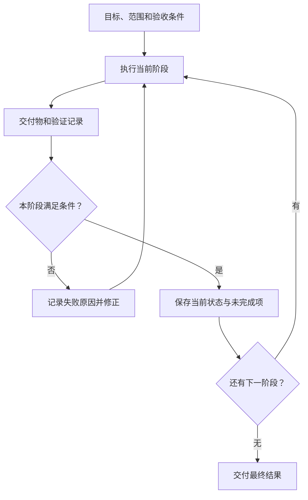
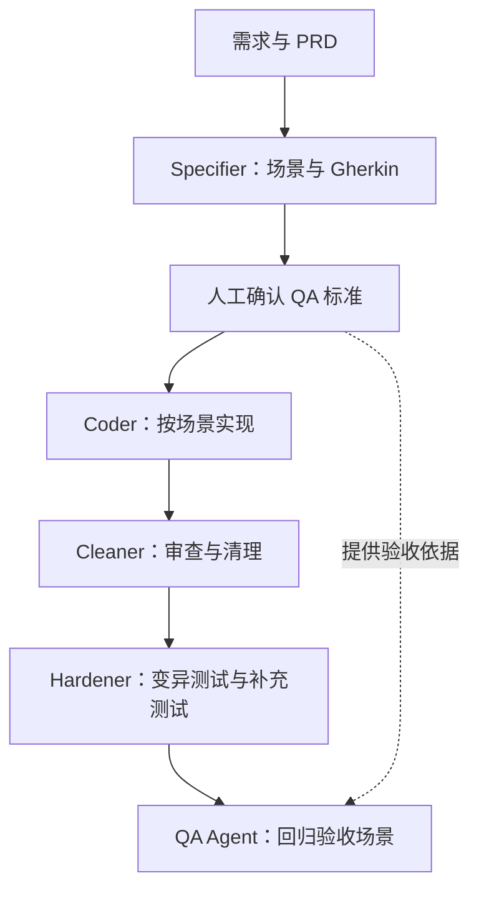

长任务复盘里，我记了一句：“人在活动 ≠ 任务在前进。”旁边记着过密的进度报告、阶段切换和不断增加的验收词汇。继续发消息、增加检查项、把计划拆得更细，都可能占用时间，却没有让交付物更接近可用。

## 开始时写清结束条件

任务开始时，写清结果、验证依据、约束、边界和停止条件，后面才容易判断工作有没有偏离。例如交付一个功能，结束条件需要对应用户能执行的行为，而不能只写“完善实现”。

任务过程中发现新的限制时，要更新这份约定。否则最初的目标在一处，后来的纠正在聊天里，执行者接到的就是两份不同要求。验收用词也应固定：实现完成、测试通过、交付可用各自意味着什么，最好能在同一处找到定义。

## 一次交接应当能让人重新开始

长任务跨阶段时，无论压缩上下文还是新开 session，都要让下一阶段拿到当前事实：已有产物在哪里，哪些检查真正执行过，未完成项是什么，下一步需要什么输入。

下面是对原页阶段关系的整理图，补上了判断与返回分支，便于说明流程；它不是某个 Agent 产品的内部实现。

查看 Mermaid 源码

只保存一段“已经做了很多工作”的摘要，接手者仍要重新搜集事实。状态文档可以更短，但需要包含能定位产物的路径、实际检查结果和还存在的问题。我对 Ralph loop 的记录也停在这里：重开上下文时，工作状态必须留在可读取的材料里。

## 独立子任务要有独立输入和输出

复盘里提到，把一个 Agent 放在需要了解过多信息的位置，会增加交接负担。可以独立完成的任务，应当说明输入、交付和失败边界。失败后主流程能知道哪里没有完成，并决定重试、改方案或停止。

是否拆分还要看收益。子任务多了，会增加解释背景、检查结果和协调状态的工作。笔记末尾特意记了“进度变慢也不要乱派 subagent”。这适合与“大 plan 带来虚假确定性”一起看：拆分只有在责任和结果更清楚时才有帮助。

## 让检查帮助下一步决定

笔记中的测试流水线把 Specifier、Coder、Cleaner、Hardener 和 QA 分开：先写验收场景，生成实现，再做审查和针对性测试，最后回到原来的验收标准。这是一种职责划分的思路，实际采用多少角色，要看任务和协作成本。

下面按这条流水线重画，保留人工定义验收和最终回归之间的关系。

查看 Mermaid 源码

这套分工的思路是让每一步产出下一步可用的材料。测试失败应能定位某个问题；进度报告应能帮助判断等待、干预还是交付。如果某条报告只重复“继续处理中”，就需要检查它是否真的增加了新的状态信息。
