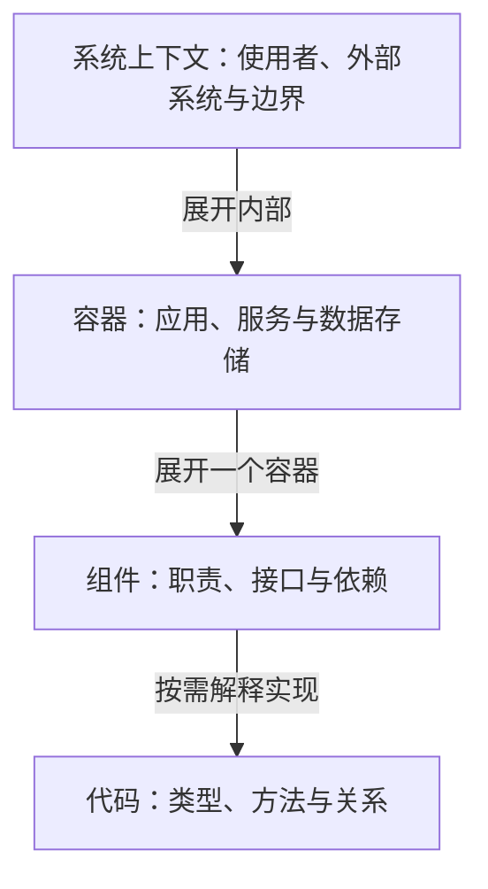
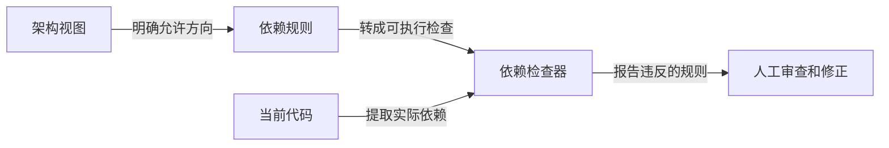

这几页笔记把两个问题写在了一起：要做的东西是否已经说清楚，以及这个方案是否行得通。PRD、架构图和代码设计分别回答其中一部分。把它们全塞进一份文档，很容易出现需求没说清、类名却已经写了一页的情况。

## 先决定图给谁看

[C4 的四个层次](https://c4model.com/diagrams)是系统上下文、容器、组件和代码。它们像不断放大的视图，读者需要的细节不同，图也跟着变化。下面把这四层画在一起；箭头表示继续展开的方向，不表示运行时调用。

查看 Mermaid 源码

需求讨论时，先让读者知道系统服务谁、依赖什么。讨论部署单元和通信时，再展开容器。组件内部的类型和签名可以放到实现说明中，不必在第一张总览图上提前铺开。C4 官方也提醒，四层不必每次画全，保留有沟通价值的层次即可。

容器图需要交代通信、端点、队列和存储。图里两块东西相连，还需要说明传递什么、经过什么协议。到 Components 层，则可以进一步交代哪个接口承担职责，以及内部实现需要隐藏哪些细节。

## 让图离开讲解也能读懂

给图一个包含类型和范围的标题，解释缩写，在线上写清关系，补上图例。这些细节决定读者能否独立看懂图。[C4 的标记建议](https://c4model.com/diagrams/notation)要求关系有方向，并让标签与方向表达的含义一致；跨进程通信还应说明技术或协议。

笔记里“中间件用虚线”的说法太绝对，需要结合具体图例理解。虚线可以在某张图里表示异步、可选关系或其他约定，具体含义应由图例解释。C4 本身不规定中间件只能采用某种形状。颜色同样如此：同步和异步若只靠红绿区分，打印或换个主题就可能看不明白。

## Spec 应当能落到一个结果

PRD 阶段可以先写 JSON 或 HTML 样例，让结果有个形状。比如要增加一个页面，就先说明用户能看到什么、哪些操作可用、失败时显示什么。样例是讨论对象，不代表背后的接口和数据已经实现。

功能规格说明用户行为和验收结果，技术规格再说明模块边界、调用顺序、数据结构与必要签名。两部分互相引用，比在需求段落里反复切换抽象层次更容易审查。对于小改动，写清当前问题、修改范围和验收方式就足够；任务越大，才越需要展开关系和阶段。

## 依赖方向需要回到代码里检查

架构图确定依赖方向后，可以把允许的关系写成规则，再交给检查器与当前代码比对。

查看 Mermaid 源码

衡量模块是否容易使用，可以看调用方需要知道多少内部信息。接口很短，使用者却要理解一串内部状态，仍然难用；文件拆得很多，也不会自然得到清楚的边界。审查时可以沿着一次真实调用看过去：调用者为了完成自己的工作，究竟被迫了解了哪些内部细节？这些具体问题，比单独统计模块数量更能帮助修改设计。
