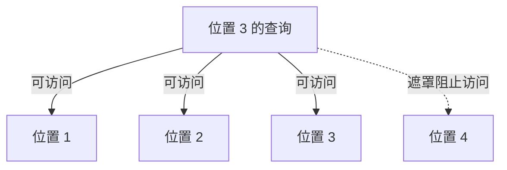

《Attention Is All You Need》只占了手写本半页，留下的是序列计算、FFN 和 masked self-attention 几个关键词。这篇按便笺的篇幅保留，不把它扩成一份完整的 Transformer 教程。

## 序列计算的限制

RNN 的序列计算不容易并行。[论文](https://arxiv.org/abs/1706.03762)提出以注意力机制为核心的 Transformer。阅读这部分时，可以把关注点放在位置之间怎样交换信息，以及哪些操作需要等待前面的计算。

FFN 是前馈网络。这次只记下了它的名字，具体维度和计算细节留待后续阅读。

## 生成时不能提前看到答案

我对 masked self-attention 的简记是：当前位置可以看自己和左边，不能看未来位置。这里指论文解码器中用于避免访问后续位置的因果遮罩，不能推广到所有 self-attention。

下面只画遮罩的可见范围。实线表示位置 3 可以访问的位置；虚线表示被遮罩的未来位置。

查看 Mermaid 源码

完整训练过程还涉及目标序列移位，不能把“看到当前位置”误解成提前读到了待预测答案。要继续展开，可以对照[原论文 PDF 的模型结构与解码器说明](https://arxiv.org/pdf/1706.03762)，补上一组输入和目标位置的对应例子。
