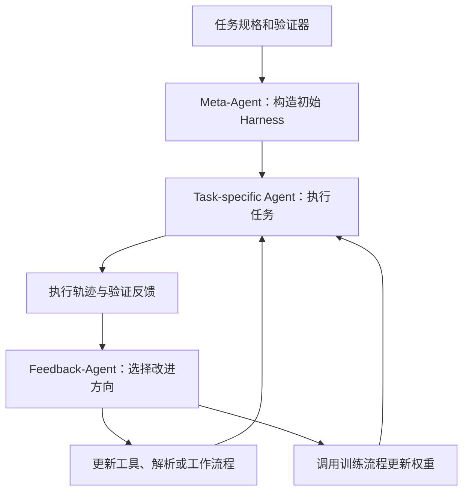

关于 AI 自我改进，笔记连续写了三页多。前面是工作流、文件记忆、子代理，后面转到模型权重更新。整理这些材料时，需要先把“改了什么”说清楚，否则换提示词、改工具和训练模型会被混成同一种进步。

## Harness 和权重是两处不同的改动

这里把 harness 理解为模型周围的运行机制，包括工具调度、提示结构、解析、重试和搜索流程。权重更新则改变模型自身的参数。它们都可能影响结果，但修改位置不同，验证时也应分别记录。

[SIA: Self Improving AI with Harness & Weight Updates](https://arxiv.org/abs/2605.27276)把这两种更新放进一个反馈循环。论文中 task-specific agent 执行任务，反馈智能体依据轨迹决定如何修改 harness 或发起权重更新。下面画出这一循环，省略训练内部步骤。

查看 Mermaid 源码

论文在法律分类、GPU kernel 优化和单细胞 RNA 去噪三个任务上比较了更新方式。这里仅整理方法，不抄写性能数字，也不把这些特定任务的结果推广成通用能力结论。原文与版本可从 [v2 全文](https://arxiv.org/html/2605.27276v2)回查。

## 完整轨迹能解释该改哪里

反馈智能体读取完整 trace，可以帮助回答一个具体问题：答案错了，是因为没有拿到材料、工具解析失败、搜索策略没覆盖到，还是模型在已有材料上判断失误？这些问题可能产生相同的低分，却需要修改不同位置。

只留一个总分，会把这些区别压平。保存轨迹时，也不必无限堆消息；应当能够定位任务输入、工具返回、关键状态变化和最终验证结果。关于路径、组件和决策可观测的记录，都可以放在这个目的下理解。

## 分数越好，越要确认实际问题有没有改善

笔记在 Goodhart effect 旁边画了框：优化的过程可能只让硬指标变好。周围列了过度乐观、失败后仍报告成功、领域判断不足和实验偏离问题等风险。这些是笔记中的研究疑问，不是对 SIA 的逐项实验结论。

要检验一次改进，可以回到失败类型上：原来失败的案例是否修好，其他案例是否退步，变更是否只是适配当前评分器。记录每轮究竟改了 harness 哪一部分、训练采用了什么流程，也方便区分效果来自哪一步。

## 还没有展开的阅读线索

另一组待继续阅读的线索包括 AlphaEvolve、ADAS、AFlow 和 STOP。不同工作允许修改的对象、调用的工具和反馈来源可能不同，逐一核实后再比较才有意义。

我还想继续弄清楚：如何选择改进方向，什么时候停止一轮更新，以及如何在新的任务上检查已经积累的经验。它们也决定了这种反馈循环需要保存怎样的状态。
