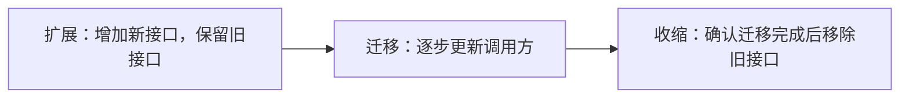
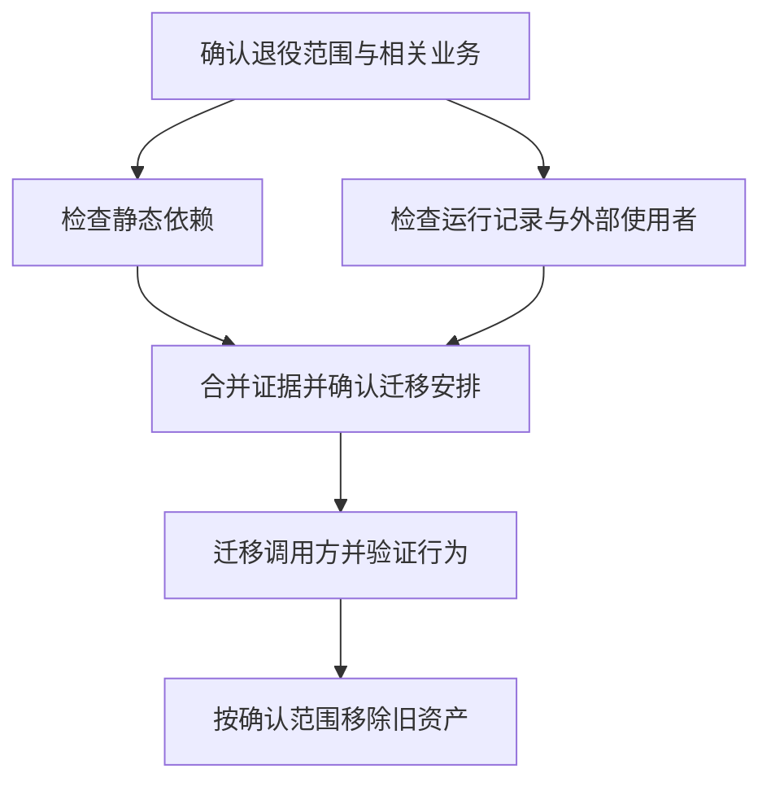

遗留系统的需求往往藏在用户操作、批处理、报表和接口调用里。只读到一份正式文档，未必能知道系统真正承担了哪些工作。笔记把“功能对等”和“功能价值”写在同一页，提醒迁移前先确认哪些行为还值得保留。

## 沿着用户工作找边界

需要调查的范围不只包含页面，还包括批处理流程、外部集成、核心算法、报表与数据。还需要“考古”：有些行为之所以存在，需要回到旧实现或使用记录里寻找原因。

调查可以从一个用户怎样完成工作开始。价值流图帮助描述过程，业务能力划分帮助找边界，事件风暴帮助讨论状态变化。具体采用哪些方法，要看缺少哪部分信息。

对于决定保留的行为，再建立相应验证。用户故事和端到端场景覆盖可见流程，接口还要考虑提供方与消费者两端。若只证明新系统内部运行正常，遗漏的可能恰好是旧系统的外部使用者。

## 用垂直切片交付一个能观察的变化

可以按业务拆分端到端流程。这样的切片可以把一个用户行为涉及的界面、逻辑、数据和接口一起交付，便于观察实际结果。切片大小仍应服从系统约束，不能只为了分阶段而切断本来不可分割的行为。

对于高度优化的算法或受明确规范约束的计算，迁移可能需要更严格的结果对照。工程和科学建模中的一些计算，就可能属于这种情况。

## 接口变化分三步走

[Parallel change](https://martinfowler.com/bliki/ParallelChange.html)将接口变更分为扩展、迁移、收缩。下面按手写箭头重画。

查看 Mermaid 源码

新旧接口共存期间，调用方有时间迁移。到收缩阶段，必须知道是否还有旧调用方；否则“删除旧代码”可能在部署后才暴露问题。这个顺序可以用于理解接口和数据库演进，但具体兼容策略仍取决于实际契约。

暗启动、绞杀式迁移、反腐层和流量分配也是可选手段。它们解决的问题不同：有的帮助观察新实现，有的隔开新旧模型，有的逐步转移入口。应当根据具体障碍选择。

## 退役要同时看引用与实际使用

清理资产时，静态依赖图能告诉我们谁引用谁，运行记录能补充真实使用情况。两种证据应当结合来看。只看搜索结果为空，可能漏掉动态调用；只看一段时间没有访问，也无法证明季节性流程不会再用到它。

退役前，可以按下面的顺序检查范围和使用情况。

查看 Mermaid 源码

组织上也需要跟进：持续改造需要稳定的责任和时间安排。一次性项目结束后，如果没有人负责后续迁移，扩展阶段留下的兼容层就可能长期存在。
