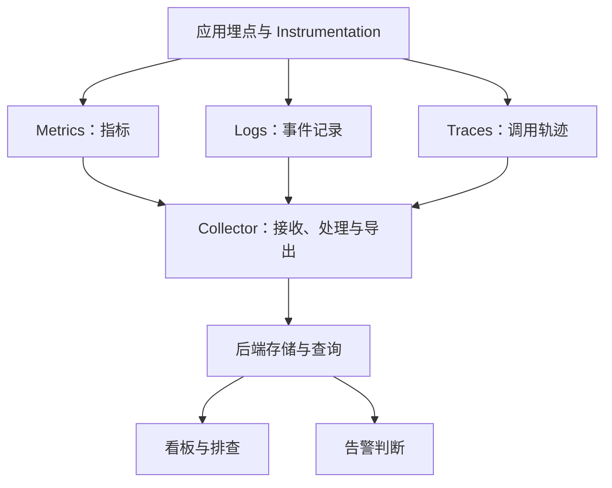
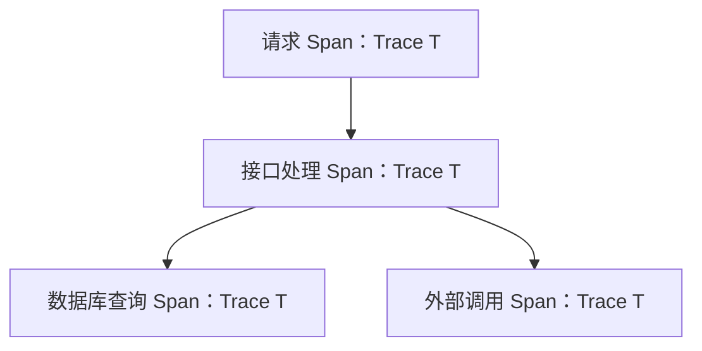

监测平台那页把埋点、数据库、看板和告警都画在了一起。回看这张图，最先需要理清的是箭头：有些表示数据流，有些表示包含关系，还有些只是工具名称的联想。如果照着画成一条链，读者会误以为 Metrics 先变成日志，再变成 Trace。

## 三种信号可以描述同一次运行

指标适合观察一段时间内的数值变化，日志保存事件记录，Trace 记录请求经过的操作。Trace 中的 Span 表示操作片段，它们通过上下文建立关系。可以参考 [OpenTelemetry 的信号说明](https://opentelemetry.io/docs/concepts/signals/)核对术语。

采集链路可以单独画出来。不同信号并列进入处理链，Collector 后的存储只是功能角色，不指定某个部署方案。

查看 Mermaid 源码

这是一种经过 Collector 的示意链路；采用直接导出等方式时，需要按实际路径调整。

## Trace 与 Span 单独画

一条调用链中的操作共享 Trace 上下文，Span 之间还可以记录父子关系。以下是一个假设请求中的父子 Span 关系。

查看 Mermaid 源码

日志如果带上对应的 Trace 标识，排查时就能把事件与调用过程联系起来。指标则可以先帮助发现异常时段，再到相关日志和轨迹里看细节。采样会影响最终保留哪些轨迹，因此没有找到某条 Trace，并不能自动证明那次请求没有发生。

## 工具名字后面还需要部署条件

Jaeger、Tempo、Loki 和 Elasticsearch 是这次记下的选型线索。比较前需要先回答：数据量多少，保留多久，主要查完整调用还是文本，是否已有相关运维能力。

这份笔记没有规模、配置和测量记录，还不足以排出成本高低。仅靠“低成本”三个字，无法判断一套方案迁入现有系统后要付出多少存储和维护开销。

## 告警之后要有处理办法

SLI、SLO、错误预算、Runbook 和 Auto-Recover 可以接在告警之后理解。先把指标、目标和处理动作分开记录：观察什么数值，什么情况需要注意，出现问题后由谁采取什么动作。

Runbook 应能帮助处理一个具体告警，包含检查入口与可执行步骤。自动恢复则需要知道动作是否生效，失败后由谁接手。这样告警出现后，维护者才能沿着已有信息继续排查，而不用重新猜整张架构图。
