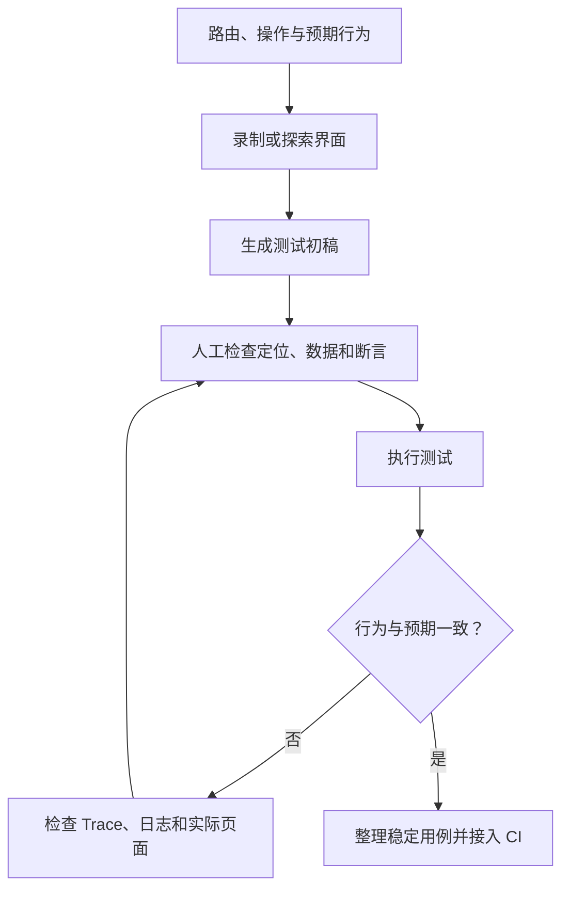

录制一次操作，能得到浏览器刚才走过的路径。要让这段记录成为长期测试，还得说明每一步为什么做，以及完成后应该看到什么。role、label、testid、trace 和 Gherkin 这些关键词，都可以放回这个问题里理解。

## 生成代码以后，先检查断言

可以用 codegen 录制操作，让浏览器 Agent 探索动态界面，再由语言模型整理测试。它们可以帮助形成初稿，初稿仍需要审查。单纯重放点击，可能只证明按钮能点、页面能切换。

比如表单提交后，测试应该检查用户可见的成功状态；若任务要求持久保存，还需要在适当位置验证保存结果。因此，导航正常，并不能单独证明功能正常。

把初稿运行起来之后，还需要根据失败信息返回修正。

查看 Mermaid 源码

## 界面变化时，别先改掉成功标准

如果变化只涉及布局，用户行为没有变，就应保留行为断言，调整定位器。这要求测试尽量从用户能识别的对象出发。[Playwright 的最佳实践](https://playwright.dev/docs/best-practices)推荐测试用户可见行为，并优先采用面向用户的定位方式，减少对 CSS 结构等实现细节的依赖。

role、label 或显式约定的 test id，可以表达定位意图。用哪一种还要看页面：如果语义和标签本来就缺失，单靠换一个定位器并不能解决全部问题。生成的选择器应当在对应范围内唯一，不能因为“这次刚好点中了”就保留。

任意插入 `waitForTimeout` 也容易带来维护问题。等待应对应可观察的条件，否则环境稍慢就失败，稍快又白白浪费时间。失败时再结合 trace、截图和日志看过程，避免只依据最后一张 DOM 快照猜原因。

## 复杂流程需要把数据条件写出来

动态数据、条件分支、OAuth 重定向和过长流程都增加了生成难度。它们要求测试明确前置状态。例如同一个按钮在不同身份下有不同结果，题面就应说明采用哪个身份、哪一种数据，以及预期落在哪条分支。

把十几步混成一段话，生成者很容易遗漏中间状态。拆分时可以围绕独立用户行为建立用例，同时保留确实需要覆盖的跨步骤流程。照片里出现的“十步以内”“五十个测试以上”等数字没有测试条件，不能用作 AI 能力的固定阈值。

## CI 要让工程师愿意相信结果

第二批笔记转向 Docker、worker、分片和资源成本。这里缺少机器配置与测量记录，所以不保留具体内存数字。值得留下的问题是：一次运行启动多少 worker，重试消耗了多少时间，是否能从报告找到失败原因。

噪声多的测试会消耗排查时间。针对同一个失败反复重试，只能说明它有时能通过；需要进一步定位是产品缺陷、数据依赖还是环境问题。对于有价值的流程，应让失败信息足够具体，能支持下一次修正。
