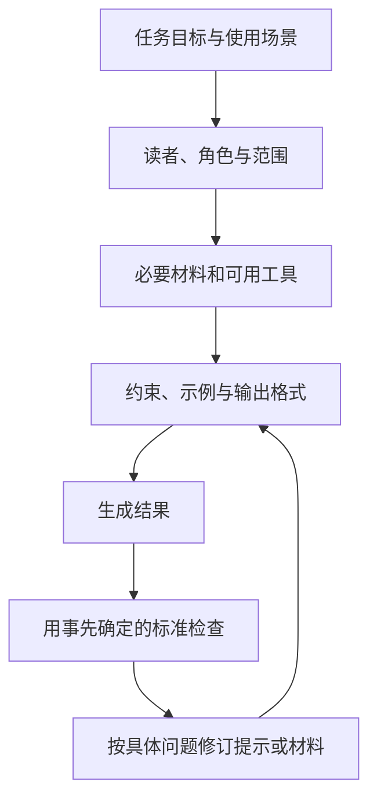
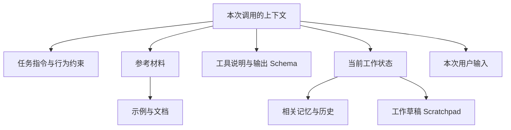

提示词笔记的前半部分是角色、受众、格式和示例，后半部分是历史截断、工具输出与状态外置。两部分要解决的问题不同：前者说明希望得到什么，后者让执行时拿到合适的材料。

## 先交代任务，再选择表达方式

写作任务需要读者画像、用途和文字风格；编码任务需要当前代码、相关版本与预期行为；研究任务需要问题范围和可回查来源；决策支持需要明确比较标准。一个通用角色提示很难交代这些差异。

示例可以说明格式和粒度，但应当与要求一致。示例里带着旧日期或旧字段，而正文要求另一种输出，执行者就会遇到冲突。对已有材料进行编辑时，还需要说明哪些内容必须保留。

准备提示词时，可以沿着下面的顺序逐项检查。

查看 Mermaid 源码

## 要求 JSON 和验证 JSON 是两件工作

结构化输出涉及提示词要求、解析失败重试和 schema 约束。文字里写“返回 JSON”之后，调用方仍要检查是否可解析；可以解析，也还要检查字段和业务内容是否满足要求。

schema 能表达字段结构，但接口支持哪些约束，需要查对应产品文档。本篇只保留概念，不给出某个 SDK 的调用方式。XML 也一样，外层标签齐全不代表里面的信息正确。

## 上下文里的材料应当能找到用途

任务指令、示例、文档、工具说明、schema、记忆、历史和工作草稿，构成了一份上下文材料清单。这里按用途整理，具体消息优先级要遵循所用接口的规则。

把这些材料按用途展开，可以得到下面这张分类图。连接线表示组成关系，不表示消息权限或发送顺序。

查看 Mermaid 源码

可以先问每份材料解决什么问题：示例说明输出，文档提供事实，工具说明限定操作，历史保存已经发生的交互，状态记录承接当前工作。无关材料越多，后续维护时越难判断哪些已经过期。

可以总结已完成子任务、裁剪工具输出、外置状态，并限制保留的历史。执行时需要保留会影响下一步的事实，例如错误信息、尚未满足的条件和明确的用户约束。压缩后若这些丢了，摘要再通顺也难以继续任务。

## 冲突、污染和过期分开处理

冲突意味着同一件事有不同要求，需要明确哪条有效；污染可能是错误或无关内容进入材料；过期则是先前成立的事实已被新状态替代。处理时应分别定位来源。

多轮对话也需要保留目标。探索范围变化时，可以借助分支对话或阶段总结重新整理输入。不能只把旧对话越叠越长，希望模型自行找出所有变更。

## 改提示词以后仍要回到样例检查

笔记列了成对比较、评分标准、LLM 评价和评估集污染。它们提醒我们，读着更顺的提示词未必在所有任务上都更好。修改后可以回看同一组典型输入，比较哪些输出改善、哪些退步，同时避免将评测答案放进上下文。
