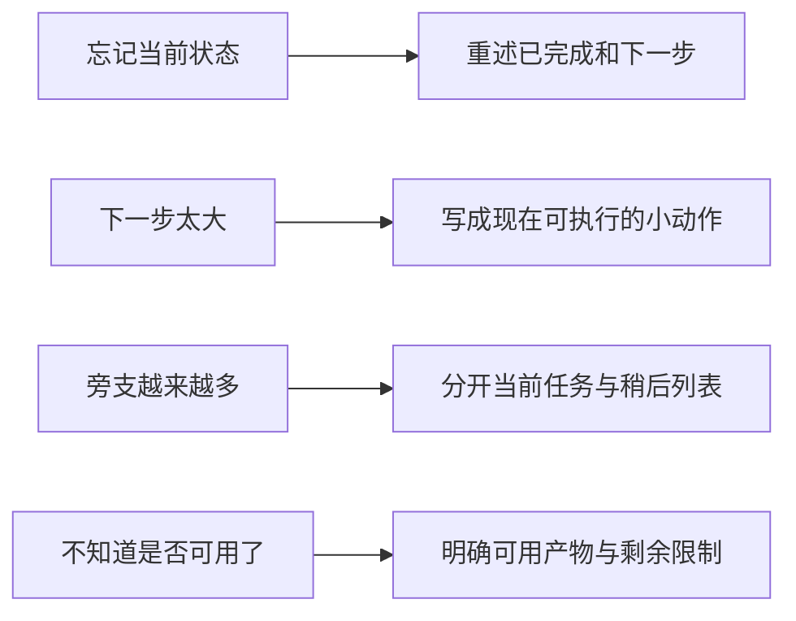

写作那几页既有句子和段落，也有“下一步必须现在可执行”“超过五条拆成 now/later”。它们关心同一个实际场景：读完一段文字后，能不能知道讲了什么，以及接下来做什么。

## 一段话先承担一个明确任务

一个段落可以解释一个概念，也可以说明一次失败。需要交代选择方案的原因时，另起一段，让理由得到足够展开。标题与开头如果只重复同一句意思，读者要往后走很久才碰到新信息。

文章开始时说明读者需要什么背景，正文按理解顺序展开。缩写第一次出现时解释，代词指向明确。长文再用目录和路标句帮助定位，不必在每一节都重新介绍全文目标。

列表适合并列项目，但项目之间若是因果关系或连续过程，就需要写出连接。把每句话前面都加一个点，不会自动形成结构。

## 图先限定范围，再补说明

给图写图注时，往往就能发现它有没有装进太多内容。手绘图里一个箭头可能同时承担时间、依赖和分类关系，重画时应先确定它表达什么。总览图可以展示范围，流程图交代顺序，调用关系则另画一张。

代码示例同样需要范围。片段是示意还是可运行代码，省略了什么输入，读者应观察哪个结果，都应交代清楚。短不等于易懂，删掉关键条件后，示例反而让读者猜得更多。

## 写作过程中的判断留给自己

LLM 可以帮助重排章节、校订文字、查找不一致，也可以按指定长度总结。我也记下一个顾虑：外包写作会失去写作本身带来的思考。尤其是初稿，描述需求的过程往往会暴露概念没有想清楚的地方。

因此，先写自己要表达的内容，再让工具帮助检查，会更容易看出它改动了哪里。引用、经历和效果都要能回到材料。总结后再检查每条信息来自哪一段，也能发现看似合理、实际没有出处的补充。

## 下一步写到现在就能执行

关于工作安排，我还记下了几种让下一步更容易开始的方法。

可以从几个具体困难入手：记不住状态，就重述当前状态；知道该做却启动困难，就把下一步写小；旁支太多，先收进稍后列表；完成感不清楚，就明确指出目前哪些产物已经可用。

箭头左边是遇到的困难，右边是可以尝试的调整。

查看 Mermaid 源码

这些方法也适合检查自己的笔记。标题下面如果只有“完善设计”，隔几天再读很难开始；写成“补上提交失败后的页面状态”，就知道要回到哪里继续。
