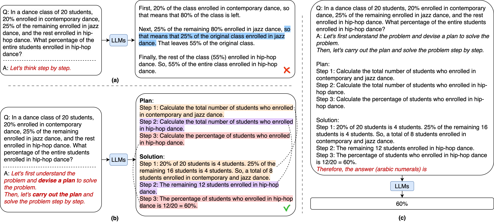

20 个学生里，20% 学现代舞，剩下的人有 25% 学爵士舞，其他人学街舞。问街舞占全班多少？这道题没多少计算，容易漏的是“剩下的人”这几个字。现代舞有 4 人，剩下 16 人，爵士舞取的是 16 的四分之一，所以街舞有 12 人，占全班 60%。

[Plan-and-Solve](https://arxiv.org/abs/2305.04091) 的图里就用了这道题。普通的逐步推理把爵士舞直接按全班 25% 算，最后得到 55%。看着每一步都在算，人数关系却从中间开始错了。换成先规划再计算以后，图中的回答先列出要算哪些人数，再按剩余人数继续，得到了 60%。

图源：[原论文 Figure 2](https://arxiv.org/html/2305.04091v3#S1.F2)，版权归原作者。这里展示的是论文挑选的例子，后面的总体实验才能说明有多少题受益。

这张图里还有一个值得仔细看的地方。Plan 只列出要算哪些人数，并没有明确说爵士舞的 25% 应该乘剩下的 16 人，这个关系是在后面的 Solution 中写对的。所以我们能看到这次回答改善了，却不能仅凭这张图确定计划中的哪句话纠正了它。把“第一步分析、第二步计算”写得更长，也没有自动解决比例取谁的问题。

PS 在 Zero-shot-CoT 的基础上，要求模型先理解问题、分解并制定计划，然后执行。PS+ 再细化变量、数值与计算检查。[作者仓库](https://github.com/AGI-Edgerunners/Plan-and-Solve-Prompting) 有具体提示版本，想尝试的话可以把同一道题分别交给它们，观察计划里有没有写出题目关系，而不只是看最后输出长了多少。

实验脚本还会做一次答案抽取。先得到计划和解答，再把这些内容送回模型，让它按要求输出最终答案，方便评分。图右边的 60% 就是这个阶段的输出。这次调用没有额外给参考答案，也不是独立验算，因此不能把两次调用简单理解成“先答一次，再检查一次”。

论文用了温度为 0 的 `text-davinci-003`。六个数学数据集的平均正确率从 Zero-shot-CoT 的 70.4%，到 PS 的 72.9%，再到 PS+ 的 76.7%；GSM8K 对应是 56.4%、58.2%、59.3%。总表能看到改善，但 [100 道 GSM8K 的错误分析](https://arxiv.org/html/2305.04091v3#S4.SS2) 更适合拿来理解该怎么用这个提示：

| 错误类别（题数） | Zero-shot-CoT | PS+ |
| --- | --- | --- |
| 漏了必要步骤 | 12 | 7 |
| 计算错误 | 7 | 5 |
| 语义理解错误 | 27 | 27 |

漏步少了，读错题的数量却没变。如果计划最开始就把爵士舞的比例理解为全班，后面照着计划认真执行仍然会错。作者另外测了只要求抽取变量的提示，GSM8K 只有 50.5%，比原基线还低，[表格](https://arxiv.org/html/2305.04091v3#S3) 里也保留了这个结果。PS+ 整体有效，并不表示其中每句要求拆出来都有用。

实际看一份输出时，可以先在计划和解答里找到同一个量，看看它的含义有没有保持一致。舞蹈题就找爵士舞人数：计划安排了计算这一步，解答又是用谁乘 25%。这样才能分清它只是没有漏步骤，还是连数量关系也处理对了，单看最后一行 60% 看不出来。
