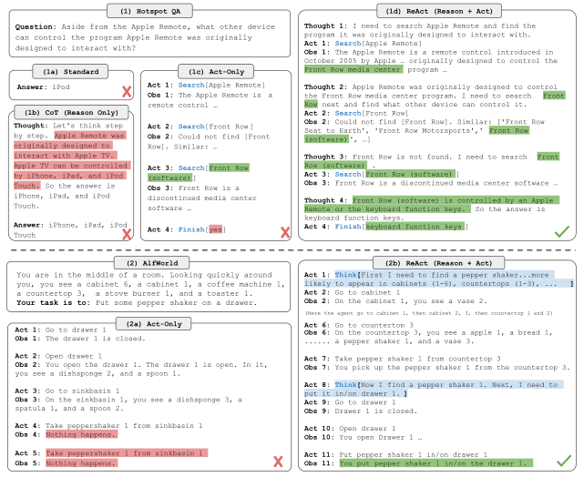

如果要给语言模型接一个搜索工具，最简单的想法就是在提示词里告诉它：“不知道的时候先搜索。”但模型写出搜索请求以后，谁去执行？结果怎么交回来？交回来以后继续搜索，还是直接回答？这些事情需要程序配合，光改提示词是做不完的。

[ReAct](https://arxiv.org/abs/2210.03629) 把这段过程写得比较直观，用三个名字记录一次循环：Thought 是模型对下一步的考虑，Action 是准备执行的动作，Observation 是动作执行后的返回。读论文时可以先不用管 Agent 的各种定义，把它看成一个边查资料边回答问题的程序就行。

## 搜索结果要真的送回去

论文里的 Wikipedia 环境只有几个动作：`search` 查页面，`lookup` 在当前页里找相关句子，`finish` 交出答案。给模型的示例也按这个格式写，模型接着示例生成下一步，程序取出 Action，调用对应接口，再把返回内容接在 Observation 后面。

下面是便于说明的伪代码，省略了接口解析和错误处理：

```python
history = [tool_instructions, react_examples, question]
for step in range(max_steps):
    thought, action = model.next_step(history)
    history.append((thought, action))
    if action.name == "finish":
        return action.answer
    observation = tools[action.name](action.input)
    history.append(observation)
```

`tool_instructions` 和 `react_examples` 分别代表工具说明和带完整轨迹的示例，模型先读这些材料才知道怎么调用。这里 `observation` 要从工具返回，不能让模型连着上面的 Action 一起编出来。否则它可以写出一整段“我搜索了什么、得到了什么”，程序却一次搜索都没做，这样的格式再像，也用不上外部资料。

论文附录有一道问题，要找 Colorado orogeny 东部延伸地区的海拔范围。名字听着陌生，但顺着检索就很好理解：先查 Colorado orogeny，当前页面只介绍这次造山活动；再用 `lookup` 找 eastern sector，知道它延伸到 High Plains。继续搜索 High Plains，结果却提示这个名字对应不止一个地区，于是加上 United States 再查，最后拿到 1,800 至 7,000 英尺的范围。[附录 C.1](https://arxiv.org/html/2210.03629v3#A3.SS1) 保留了完整提示轨迹。

搜索 High Plains 时遇到的歧义很关键。下一步里的 United States 是为了解决刚看到的问题，事先写一份固定搜索清单就未必能处理好。我们自己接工具时也需要留出继续查的入口，不能第一次搜索结束就无条件进入总结。



图源：[论文 Figure 1](https://arxiv.org/html/2210.03629v3#S1.F1)，版权归原作者。看图时可以对照每次 Observation，再往下看模型采取了什么动作。

Thought 也不需要每步都写很长。在交互环境里，连续执行几个已经明确的动作很正常，碰到障碍再重新考虑。[项目页](https://react-lm.github.io/) 展示了这种稀疏推理的轨迹，也保留了失败示例。这样的记录比较方便调试：动作执行失败，后面有没有发现；搜索没找到，模型有没有换查法。调试时把实际返回和后续动作对照起来看，比单独读 Thought 更容易发现问题。

## 接上搜索以后，成绩也有退步的地方

ReAct 在 HotpotQA 的精确匹配是 27.4，CoT 是 29.4；FEVER 则是 60.9 对 56.3，用的都是论文中 PaLM-540B 的设置。[表 1](https://arxiv.org/html/2210.03629v3#S3.SS2) 并没有得出每个任务都提升的结果。作者在错误分析里提到，搜索质量会影响 ReAct，有时它会反复采取相同动作。查不到相关页面时，循环一直运行也不能补出需要的知识。

调试时可以从最终答案往回查。找到其中一个事实，看哪次返回提供了它；没有对应材料，再查 query 是否写偏，还是生成时自己补上了内容。重复动作也能直接从轨迹发现，例如同一个 query 连续执行却没有新结果，就该检查停止或改写条件。[代码与提示示例](https://github.com/ysymyth/ReAct) 里保留了这些调用格式，接自己的工具时可以逐段对照。
