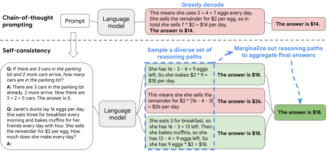

CoT 每次生成一条解题过程，如果恰好在中间算错，就可能把错误带到最后。[Self-Consistency](https://arxiv.org/abs/2203.11171) 换了一个很容易尝试的办法：同一道题独立生成多份完整解答，最后选择出现最多的答案。做题过程可以不一样，统计时只看最终结果。

为了把这一步讲清楚，我们先拿一组自拟结果作演示。假设题目是 24 个苹果每盒装 4 个，问需要几盒，模型的五份输出如下。这里没有实际调用模型，表格只是展示统计方法。

| 第几份 | 输出末尾 | 提取后的答案 |
| --- | --- | --- |
| 1 | 需要六盒 | 6 |
| 2 | 24 ÷ 4 = 6，所以是 6 盒 | 6 |
| 3 | 需要 8 盒 | 8 |
| 4 | 答案：6 | 6 |
| 5 | 需要 4 盒 | 4 |

三份得到 6，所以选择 6。如果直接把整段文本当作计数的键，第一、二、四份会被分到三组，明明是同一个答案也凑不到一起。实际实现先做答案抽取和归一，再计数。上表已经提取好了，可以直接运行下面这个小例子：

```python
from collections import Counter

answers = [6, 6, 8, 6, 4]
answer, votes = Counter(answers).most_common(1)[0]
print(answer, votes)  # 6 3
```

数值题里，中文数字、单位、小数写法都可能影响归一；选择题则要把答案落到选项。长篇文章没有这么清楚的答案集合，两段文字是不是同一个观点，需要另外定义，不能直接把这个计数程序搬过去。



图源：[论文 Figure 1](https://arxiv.org/html/2203.11171v4#S1.F1)，版权归原作者。它没有在中间步骤做投票，也没有把几份过程拼成一份共同解法。

生成多份时还要让结果确实有差异。每次都用贪心解码，通常只会反复得到同一份内容；论文使用温度、top-k 或 nucleus sampling 等方式采样。各次都从同一道问题出发，不把上一份答案接进去继续写。模型也没有互相讨论，所谓“多条路径”就是同一模型的多次生成。

主实验每轮取 40 条，并对 10 轮结果求平均。PaLM-540B 在 GSM8K 上从单条 CoT 贪心解码的 56.5% 到 74.4%，提高 17.9 个百分点。作者比较过不同答案聚合方式，简单多数票已经有不错的表现，增加样本数通常继续改善，但收益逐渐变小。[方法与实验](https://arxiv.org/html/2203.11171v4#S2) 可以一起看。要用于自己的程序，调用次数也得一起算，不能把四十份生成的费用和一次调用混着比较。

回到苹果的例子，三票能盖过两次偶然错误。不过如果把题目改成“每盒最多 4 个，其中 8 个已经坏了，只装好的苹果”，模型却反复忽略坏苹果，就会仍然给出 6；实际只剩 16 个好苹果，需要 4 盒。几份结果可能一起犯这个错。这是为了说明共同错误的另一个自拟例子：多次调用仍然共享同一个模型的知识与理解习惯，次数增加不会保证它注意到遗漏的条件。

上表的 3/5 因此只能读作五份中有三份一致，不能直接说答案有 60% 概率正确。这个方法据此选出答案，一致比例本身还没有经过正确概率的校准。
