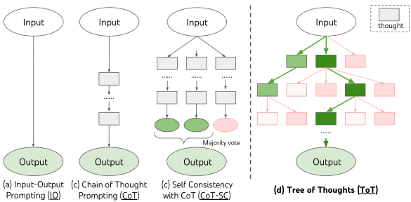

`4、7、8、8` 可以怎样算成 24？这是一道自选示例，先用两个 8 相除，得到 1，剩下 `4、7、1`；再算 7 减 1，最后 4 乘 6 就做出来了。第一步只得到一个 1，并没有立刻出现看起来接近 24 的数，但这条路能走通。

[Tree of Thoughts](https://arxiv.org/abs/2305.10601) 把这种中间状态也拿出来比较。模型不必先写完一条完整解法，系统可以保留几种开头，继续其中较有希望的几种，发现走不通再换。要理解这个方法，我觉得先把程序需要保存什么写出来，比先看一棵复杂的树更容易。

```text
起始：4, 7, 8, 8
操作：8 / 8 = 1
剩余：4, 7, 1
操作：7 - 1 = 6
剩余：4, 6
操作：4 * 6 = 24
```

同一层还可以暂存另一种开头：`8 - 4 = 4`，剩下 `7、8、4`。这条路也能继续用 `7 - 4 = 3`、`3 * 8 = 24` 完成。两个开头都先留下，下一层各自生成后续操作，就是这里要表达的分支；它们不是原论文的采样记录。

每做一次运算，取走两个数、放回一个结果。剩余数字和此前的操作一起构成状态，只有最终算到 24，并且原数字使用规则满足，才算完成。我们能把这里的一步说清楚，程序才知道不同候选在比较什么。

论文让模型提出候选操作，也让模型估计后续是否可解，用 sure、maybe、impossible 等判断指导搜索。外部程序负责保存状态、选择分支和检查最终表达式。评价仍然可能错，例如把上面得到 1 的分支过早丢掉，后面就没机会沿它走到 24。增加分支数量给了更多机会，但这些机会还要经过同一个评价过程。



图源：[论文 Figure 1](https://arxiv.org/html/2305.10601v2#S1.F1)，版权归原作者。ToT 的选择发生在完整答案出现以前，Self-Consistency 则先生成完整解，再统计终点。

在 24 点实验中，BFS 每层留下若干状态，分别继续扩展。宽度设成 1，就只留一个；设成 5，可以让五种中间情况继续竞争。GPT-4 在 100 道较难题上，CoT 为 4%，采样 100 条完整解法的 CoT-SC 为 9%，ToT 宽度 1 是 45%，宽度 5 是 74%。[这组实验](https://arxiv.org/html/2305.10601v2#S4.SS1)里，选择中间状态带来的差别很明显，代价则是额外生成和评价候选，不能当成在原提示末尾加一句话的免费提升。

DFS 的安排不同，先沿一条分支深入，遇到不合适的状态再退回来。到了迷你填字任务，状态变成当前格子和已填单词，某个词放进去以后会限制交叉位置；创意写作则可以把计划作为 thought。它们没有统一的一步长度，作者要针对任务定义生成和评价方式。

所以照着 [作者代码](https://github.com/princeton-nlp/tree-of-thought-llm)做一个小实验，先用 24 点这类状态明确的任务比较容易。我们知道剩余数字是什么，也知道最终表达式怎样验证。换成长文以后，要保留的是一个词、一段提纲还是整份草稿，就得重新决定，不能把 24 点的状态直接改个名字继续用。
