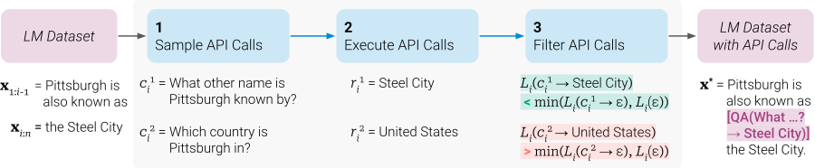

一段文本准备介绍 Pittsburgh 的别称，模型可以向工具问“它有什么别称”，也可以问“它在哪个国家”。两个问题都能得到正确事实，但接下来要写的是 Steel City，问国家对这段续写没有多少帮助。

[Toolformer](https://arxiv.org/abs/2302.04761) 的 Figure 2 就把这两种候选放在了一起。这个例子很适合说明训练数据怎么筛：调用成功不够，返回还得对眼前这段文本有用。否则模型很容易学会到处调用工具，文章却没有因此更好地往下写。

图源：[论文 Figure 2](https://arxiv.org/html/2302.04761v1#S1.F2)，版权归原作者。图中没有给出这两条候选的具体损失值。

论文先给每种工具少量人工示范，让模型在普通文本的合适位置提出调用候选；真正执行以后，再分别计算后续文本的预测损失。比较用三种上下文：完全没有调用、写了调用但没有返回、调用和返回都在。最后一种要比前两种中较好的那一个还好，并超过阈值，才留下这个样本。

为什么连“只有调用”也要比？因为问题本身也可能提供提示。如果模型问了别称，这几个字就已经透露接下来大概会说什么；筛选还要确认工具返回确实额外帮了忙。按这个办法，关于国家的正确事实可能被丢掉，能帮助续写别称的结果则留下。

计算器的例子也很清楚。原文要从 1400 名参与者、400 人通过，写到通过比例，在中间插入除法调用，返回舍入后的 0.29，再继续写 29%。这里工具提供了下一段需要的计算结果，文本仍然按照原本的句子往下生成。训练好的模型到调用结束处暂停，由外部执行器计算、接回结果，再继续输出。

筛好的增强文本用来继续训练 GPT-J 6.7B，目标仍是预测后续 token。模型由此学到什么时候插入调用、怎样写参数，以及怎样利用返回。它没有凭空获得计算器或搜索能力，每种 API 还要有人实现，候选也必须真正执行。Wikipedia 搜索与计算器留下的数据量不同，过滤阈值提高以后，能留下的候选还会显著变少，这些都是造训练集时实际要付出的工作。

在 SVAMP 上，原始 GPT-J 是 5.2，Toolformer 训练后禁用工具为 6.3，启用工具后为 29.4。[这组比较](https://arxiv.org/html/2302.04761v1#S4.SS2) 特意把接到返回这件事分了出来，光训练过带调用的文本，并没有拿到相同收益。主评测每个输入最多一次 API 调用，因此先查人名再查这个人的资料这样的依赖链，还不能从这组结果直接推出来。

[原论文的数据构造部分](https://arxiv.org/html/2302.04761v1#S2)列了过滤和采样设置。调整阈值以前，先确认比较的是哪段后续文本，才能知道为什么一个事实正确的工具返回仍然会被丢掉。
