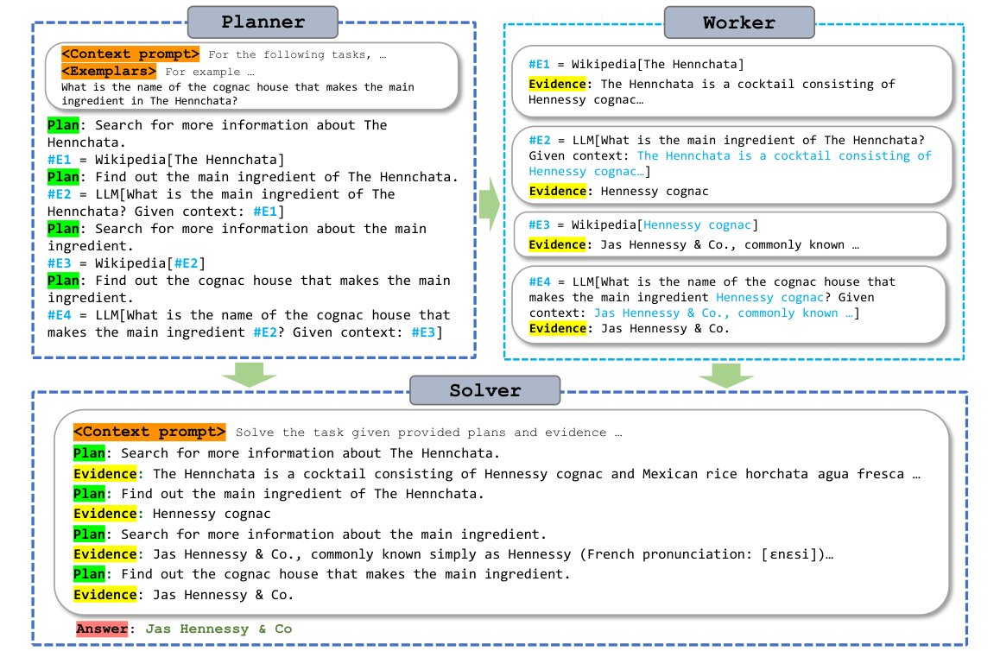

ReWOO 的计划里会出现 `#E1`、`#E2` 这样的名字。第一次看容易以为它们只是步骤编号，其实后面的工具调用可以直接引用前面的结果。模型写计划时还不知道结果，先给它留一个名字，执行时再替换进去。

[论文](https://arxiv.org/abs/2305.18323) 附录 C.3 有一道买鸟的题：John 从四位祖辈那里各拿到 50 美元，每只鸟 20 美元，问买到的鸟一共有多少翅膀。按题目语境，每只鸟两只翅膀，算出总钱数、鸟的数量，再乘二就行。原文展示的计划多写了一步，下面按原例整理，保留全部调用及返回：

```text
#E1 = Calculator[50 * 4]          → 200
#E2 = Calculator[20 * (#E1 / 20)] → 200.0
#E3 = Calculator[#E1 / 20]        → 10.0
#E4 = Calculator[#E3 * 2]         → 20.0
```

Worker 先取得 `#E1`，再把 200 代入后面需要它的位置。`#E3` 得到 10，`#E4` 接着得到 20，Solver 最后整理成答案。这里提前知道的是依赖关系，结果仍然需要等工具返回，所以写完全部计划不等于所有步骤可以同时执行。

再看 `#E2`，它把买鸟数量乘回单价，又得到总钱数，后续工具没有依赖它，算出翅膀数量也不需要这一步；Solver 仍然会收到这条证据。这是[原例](https://arxiv.org/html/2305.18323v1#A3.SS3)留下的冗余步骤，我觉得很值得保留。它说明 Planner 可以产出能用的依赖图，同时仍然夹带没有必要的工作。若介绍时替它删得干干净净，就看不见实际生成的计划还有什么问题了。



图源：[论文 Figure 1](https://arxiv.org/html/2305.18323v1#S1.F1)，版权归原作者。

Planner 一次安排任务，Worker 按依赖拿证据，Solver 看计划与结果作答。相比每拿到一个结果就再问模型下一步做什么，这样少了多次读取整个运行历史的过程。买鸟题后面的方向都能提前决定，用占位符就够了；如果搜索返回同名人物列表，必须先消歧才知道后续查谁，预先计划就可能需要调整。论文也把更复杂的动态规划列作后续方向。

HotpotQA 实验在相同工具与六个示例下，ReAct 平均每题使用 9795.1 token，ReWOO 是 1986.2，统计也计入模型工具用量。节省相当明显，不过结果的两个口径不同：GPT-4 语义评审 Acc 从 40.8 到 42.4，EM 从 32.2 到 30.4。只用一句准确率提高概括，会把精确匹配的下降省掉。[实验表](https://arxiv.org/html/2305.18323v1#S3)

其他任务也没有统一获益。TriviaQA 直接回答为 80.6，ReWOO 为 66.6；GSM8K 的 CoT 是 67.4，ReWOO 是 62.4。

这些数字里，我更容易从买鸟题看懂 ReWOO 省了什么，又没省什么。`#E1` 允许程序接住结果继续执行，少问一次下一步；`#E2` 却仍然浪费了一次计算。规划提前写好以后，整份计划本身也成了可以检查和删减的对象。[作者代码与数据](https://github.com/billxbf/ReWOO)保留了更多这种计划。
