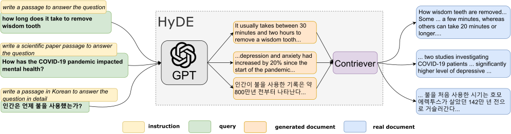

HyDE 先让模型写一段假想文档，再拿这段文字去查真实资料。这个顺序很反直觉：我们不就是因为不知道答案，才需要检索吗？为什么中间先加了一份可能写错的回答？

[论文](https://arxiv.org/abs/2212.10496) 要解决的是查询和文档的表达差异。用户问题可能只有一句口语，相关文档却使用更完整的术语和解释。让模型先生成“相关文档大概会怎样写”，可以为查询补充这些表达，再交给编码器生成向量，从真实语料索引里找近邻。

图源：[论文 Figure 1](https://arxiv.org/html/2212.10496v1#S1.F1)，版权归原作者。

图里的问题问拔智齿要多久。假想文档写了约 30 分钟到两小时，旁边检索回来的片段却谈到不同拔除过程，有几分钟，也有超过 20 分钟的描述。这里先不用判断这些片段适用什么情况，只需要看到：生成草稿和检索结果并没有逐项一致。草稿提供了话题与词汇，真实文档才是后续需要继续阅读的材料，图里的生成数字不能直接搬成回答。

这也是 HyDE 和“让模型补知识库”的区别。假想段落只用于形成查询表示，没有作为可信文档加入索引。查回来的仍是原有语料。原方法还可以生成多篇、平均向量，也可以把原查询向量一起平均，减少一次措辞对结果的影响。

作者用稠密瓶颈解释编码器可能过滤生成文本中的部分无关细节。这个解释并不是说编码器会检查数字真假：它把一段文字压成向量，并没有逐条核对草稿。如果错误内容改变了主题表达，检索仍然可能偏。原图之所以值得看，恰好是它把草稿与真实结果放在两边，我们可以直接比较哪些词帮助找到了相关材料，哪些细节并没有得到同样支持。

实验用 `text-davinci-003`、温度 0.7 生成假想文本，英文检索用 Contriever，多语言用 mContriever。TREC DL19 的 nDCG@10 从 44.5 到 61.3，DL20 从 42.1 到 57.9。nDCG@10 看前十条的相关性和排列，不是最终问答正确率；“无需相关性标注”也指不使用目标任务的查询与相关文档配对训练，不是从没训练过模型。[方法与实验设置](https://arxiv.org/html/2212.10496v1#S3)

基线里 BM25 在 DL19 有 50.6，比单独 Contriever 高；TREC-COVID 上 BM25 为 59.5，HyDE 为 59.3。这些结果让我觉得，尝试 HyDE 以前，先把已有关键词检索的结果摆在旁边会更有用。换一种查询表达能改善一些问题，具体任务是否需要这次生成开销，可以直接比较召回结果。

如果把它接进问答程序，查询草稿和证据列表最好保留不同字段。[作者实现](https://github.com/texttron/hyde) 中生成、编码和检索各有步骤，我们也可以照着把材料来源区分开。这样最终生成答案时，读取的是召回原文，原来那份假想文档不会因为已经在上下文里，就顺手被当成另一个来源。
