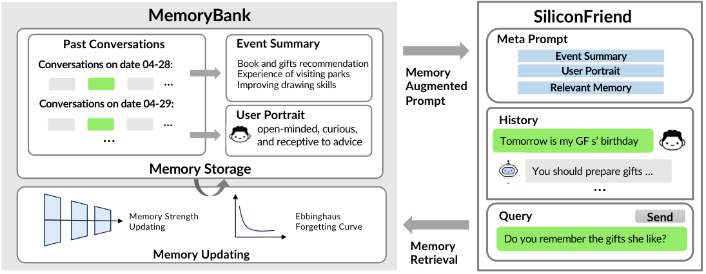

Gary 在 5 月 3 日说自己压力大、睡不好，助手给了一些建议；到 5 月 10 日，他又问之前推荐过什么。MemoryBank 的表格把这次延迟查询和几个版本的回答放在一起，问题很简单：上一周说过的话，今天还能不能找回来。这里用的是合成用户对话，不是一个真实用户的医疗咨询记录。[论文 Table 1](https://arxiv.org/html/2305.10250v3)

[MemoryBank](https://arxiv.org/abs/2305.10250) 保存带时间的对话，整理每日与全局事件摘要，也概括用户画像，回答时再检索相关记忆。Gary 问过去的建议，需要的是那次对话；如果只记成“这个人经常有压力”，虽然听起来认识他，仍然回答不了原问题。



图源：[论文 Figure 1](https://arxiv.org/html/2305.10250v3#S2.F1)，版权归原作者。图中摘要和画像是架构示例，没有展示每句概括如何从原对话逐步生成。

它另外加入了一个遗忘设想。论文写 `R = exp(-t / S)`，时间 `t` 越长，保留程度越低；强度 `S` 越大，下降越慢。新记录强度为 1，记忆被召回以后强度加一，时间重新计起。按这个设计，经常用到的事会留下更久。

不过读固定版本的 [forget_memory.py](https://github.com/zhongwanjun/MemoryBank-SiliconFriend/blob/cf61c4196e4cfdb0f2b7a0316249fa40312dc3a9/memory_bank/memory_retrieval/forget_memory.py)，实际这一行是：

```python
return math.exp(-t / 5*S)
```

Python 会从左往右做这里的除法和乘法，相当于 `exp((-t / 5) * S)`，没有把 `5*S` 整体放进分母。只看这行还容易顺着论文把它读成强度越高越不容易忘，代两个数就能发现方向相反。

| 同样取 t = 5 | S = 1 | S = 2 |
| --- | --- | --- |
| 论文公式 exp(-t / S) | 约 0.0067 | 约 0.0821 |
| 该代码表达式 | 约 0.3679 | 约 0.1353 |

表里只是公式计算值，不是运行实验的实际留存率。第二行中，强度增加，保留概率反而下降。代码随后用随机数与概率比较决定遗忘，而召回更新函数确实会把强度加一、修改最后召回日期，因此这个差异会影响如何理解那份实现。这是固定版本实现与论文的差异。

定量评测使用 15 名虚拟用户的十天对话和 194 道探测问题，也区分找到材料和回答是否正确。英文条件下，ChatGPT 版本检索得分为 0.763、回答得分为 0.716；BELLE 的检索为 0.814，回答为 0.479，回答得分允许部分正确。这两项分开以后，才能看出记忆取回来是否真的被用对。

这篇我会把公式和代码并排留着。两边都叫记忆强度，但同样加一，表里却朝相反方向变化，复用这个版本前需要先处理表达式的差异。
