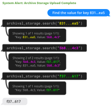

有一张键值表，A 对应 B，B 又对应 C，C 不再是其他记录的键。现在问 A 最后对应什么，拿到 B 就回答显然早了一步，拿到 C 以后也还得确认它是不是终点。

[MemGPT](https://arxiv.org/abs/2310.08560) 用这种嵌套键值任务检查模型能不能继续检索。正式题用 UUID，不是容易凭含义联想的 A、B、C。论文 Figure 8 展示的一条路径，可以保留缩写写成：

```text
查询键 831…ea5
  → 找到值 5b8…4c3
  → 把 5b8…4c3 作为键继续查
  → 找到值 f37…617
  → 再查 f37…617 是否出现在 Key 一侧
  → 确认终止值后返回 f37…617
```



图源：[论文 Figure 8](https://arxiv.org/html/2310.08560v2#S3.F8)，版权归原作者。

这段记录里，最后一次搜索仍可能返回包含相近内容的记录，所以不能用“搜索有结果”作为继续的条件。要看匹配到的是不是 Key 字段，以及这个键是否还有下一层值。检索接口返回东西、找到目标记录、走到链尾，是三次不同的判断。

我觉得这比一句“支持长期记忆”具体得多。数据明明在窗口外，也有接口可查，模型仍可能太早停下。MemGPT 允许函数调用完成后继续运行，用分页拿更多结果，直到获得足够信息再给用户回复。一次取太多又会挤满窗口，因此检索本身也得分批。


图源：[论文 Figure 3](https://arxiv.org/html/2310.08560v2#S1.F3)，版权归原作者。

当前上下文包括只读系统指令、可写 working context 和先进先出的消息队列。窗口外的 recall storage 保存历史消息，archival storage 放长资料。模型通过函数在这些位置读写，常用信息放工作区，临时交流进入队列，需要旧材料再去检索。

队列快满时，系统发送 memory pressure 提示，让模型有机会保存重要内容；达到清理条件后，旧消息移出当前窗口，并递归整理摘要。约 70% 容量预警是论文给的一项配置。旧消息退出窗口以后仍可回查，所以摘要没留下某个名字，不必等于那个名字永久丢了。这里的外部存储和查询函数都是真正的系统部件，只给模型加一句请记住所有内容，实现不了这条路径。

深层记忆实验用五段历史会话，再提出第六段中的问题。GPT-4 基线读的是有损摘要，MemGPT 能分页查完整历史，准确率从 32.1% 到 92.5%，ROUGE-L recall 另列为 0.296 和 0.814。这组比较说明完整历史访问很有用，也包含了两边能读到的材料不同，不能当成同等输入预算下只换一个提示的提升。[表 2](https://arxiv.org/html/2310.08560v2#S3.SS1)

嵌套键值任务固定 140 对、约八千 token，换用 GPT-3.5 或 GPT-4 Turbo 时仍有提前停止的问题。资料能存下来只是起点，连续查询怎么安排，什么时候算查完，都会改变最终答案。A 到 B 再到 C 这个小例子，已经把这种差别摆出来了：第一个返回没错，直接拿它作答却还是错。[论文项目页](https://research.memgpt.ai/)保留了这套记忆管理设计。
