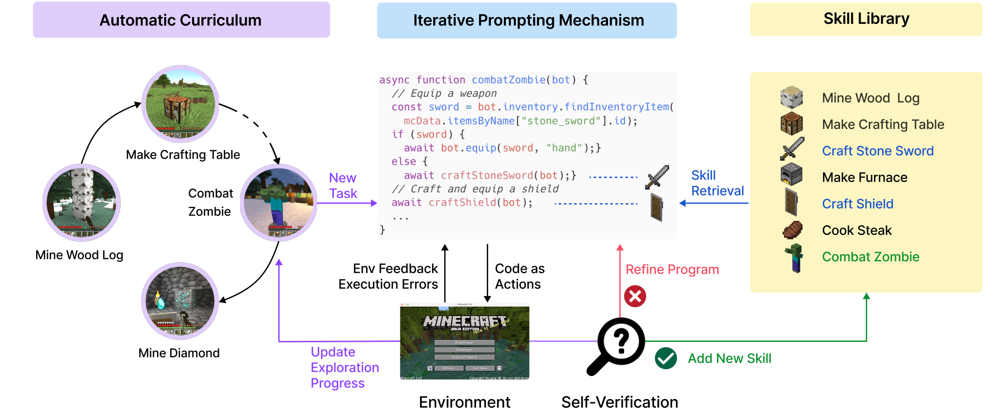

Voyager 说自己会积累技能，实际保存的东西是什么？打开官方技能库，可以找到一个很直白的文件：`craftIronPickaxe.js`。里面没有一大段“制作铁镐的经验”，而是一段读库存、补材料、放工作台、合成物品的 JavaScript。

按这份[实际技能代码](https://github.com/MineDojo/Voyager/blob/55e45a880755d0c8c66ca7fb5fe7962ac8974f89/skill_library/trial1/skill/code/craftIronPickaxe.js) 的顺序，可以整理成：

```text
读取铁锭和木棍数量
铁锭不足 3 个：挖矿，再冶炼
木棍不足 2 根：调用制作木棍的操作
在附近放置工作台
制作一把铁镐
```

这就让“学会了”有了具体内容。下一次需要铁镐，不必从头生成所有动作，可以取回这段代码，再和当前任务组合。它也会看库存，已经有材料时能少做一些准备。但检查并没有覆盖所有前提，例如煤和工作台等条件还会影响后续操作。代码曾经能完成任务，换个背包状态不一定直接照跑就行。

[Voyager](https://arxiv.org/abs/2305.16291) 用模型生成这样的程序，通过 Mineflayer 的 JavaScript 接口操作 Minecraft。输入是文字状态，包括背包、装备、位置和任务等，没有要求模型只看屏幕像素识别环境。自动课程根据现状和已完成、失败的任务提出下一目标，代码生成时再取相关技能一起参考。



图源：[论文 Figure 2](https://arxiv.org/html/2305.16291v2#S1.F2)，版权归原作者。

程序运行以后还要判断任务完成没有。环境事件能告诉系统做了什么，代码错误说明调用哪里出问题，critic 则对照目标和当前状态检查结果。[执行循环](https://github.com/MineDojo/Voyager/blob/55e45a880755d0c8c66ca7fb5fe7962ac8974f89/voyager/voyager.py) 把这些信息送进后续提示，让下一次修改有东西可用。

论文附录 A.5.2 的一个验证提示示例很适合说明区别：库存有工作台、6 块云杉木板和 4 根木棍，目标是制作木镐。验证输出仍然说没完成，因为材料虽然齐了，木镐还没做出来，并提示使用工作台、3 块木板和 2 根木棍制作。这个示例不是实际失败日志，不过把要检查的状态说得很清楚：程序跑完、材料备齐、目标物品出现，各是不同的事情。

成功程序连同描述进入技能库，描述的向量用于检索，每次取最相关的五项给后续任务。模型参数没有在探索中更新，积累的是可调用代码。新世界的 zero-shot 复用也带着旧技能，并不是完全空手开始。这种方式很像保存自己写过的工具函数，便利来自下次能够复用，麻烦也同样来自函数的适用条件。

论文主要使用 `gpt-4-0314`，辅助任务用 `gpt-3.5-turbo-0301`，在 160 次 prompting iterations 中发现 63 种物品，约为作者所用比较基线的 3.3 倍，且在那组实验中到达了钻石工具层级。这个范围下的 [探索结果](https://arxiv.org/html/2305.16291v2#S3.SS3) 能说明技能积累的作用，相关消融也分别移除了课程、技能库和反馈，用来比较各部分的作用。

回到铁镐文件，读技能最方便的办法是给它换一种假定库存，逐行想会走哪个分支。铁锭有了、木棍不够，程序会补木棍；材料都齐却没有工作台，后面的放置就需要再处理。把这些前提写清，才能知道下一次检索到的代码可以直接用多少，还要补多少准备。
