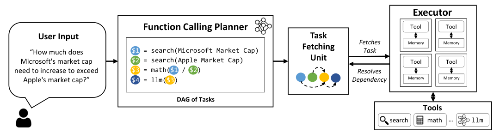

要比较两组海沟的绝对深度差，再求较小的差值，一共需要查四个地方。查完马里亚纳海沟才能查波多黎各海沟吗？这两次搜索之间其实没有依赖，等它们都回来以后才能做的，是后面的减法。

[LLMCompiler](https://arxiv.org/html/2312.04511v3) 官方 ParallelQA 提示里就有这个例子。Planner 把工作拆成下面的计划，数字表示任务编号，后面的计算引用前面结果。这里按[原示例](https://github.com/SqueezeAILab/LLMCompiler/blob/a00c9d35507507da70e8c637eee64efc8c1857ae/configs/parallelqa/gpt_prompts.py)重新整理，不是一次实测运行：

```text
1  查询 Mariana Trench
2  查询 Puerto Rico Trench
3  计算绝对深度差，依赖 1、2
4  查询 South Sandwich Trench
5  查询 Sunda Trench
6  计算绝对深度差，依赖 4、5
7  取较小差值，依赖 3、6
8  join，汇总结果
```

`1、2、4、5` 可以先发出去。哪一组先回来，哪一组的差值就能先算，不需要让 3 等到 4、5 也完成；7 才需要同时等两个差值。这么看，程序要解决的主要是“依赖齐了没有”，没必要每次有工具返回，都再请模型确认一句现在可以做减法。

Planner 用 `$1` 等引用尚未返回的结果，Task Fetching Unit 检查依赖是否就绪，Executor 调用工具。职责按这个顺序拆开以后，模型写出计划，程序接着管理执行。



图源：[论文 Figure 2](https://arxiv.org/html/2312.04511v3#S2.F2)，版权归原作者。

还有一段等待发生在规划本身。论文允许计划流式输出，第一个工具调用写完整后就可以启动，Planner 同时继续写后面的任务。这样查询和规划重叠，不必等整张图输出完才执行第一步。四路查询可以并行，与规划执行可以重叠，是两处不同的时间安排。

如果问题中有条件分支，例如先比较结果，再查较深的那一处的其他资料，后续目标需要等结果才知道。框架保留动态重规划，把中间结果交回 Planner，继续产生任务。前面的引用解决已知计算依赖，重规划处理收到信息以后才产生的新决定，不能因为想并行就把未知条件也提前猜好。

论文的一组 GPT-3.5-turbo 1106 比较里，HotpotQA 比较题有约 1500 道，电影推荐有 500 个样本，分别有两路和更多可展开的独立工作：

| 任务 | ReAct 延迟 | LLMCompiler 延迟 | 两者准确率 |
| --- | --- | --- | --- |
| HotpotQA 比较题 | 7.12 秒 | 3.95 秒 | 62.47% / 62.00% |
| 电影推荐 | 20.47 秒 | 5.47 秒 | 72.47% / 77.13% |

[表 1](https://arxiv.org/html/2312.04511v3#S5.SS1) 的 ReAct 是作者补过提示、减少重复调用与提前停止的版本。比较题主要减少等待，准确率没有提高；电影任务独立工作更多，加速更明显。把这种结果拿来估自己的任务，先数依赖往往比先记最大加速倍数更实用。

我们自己画计划时，也可以沿海沟例子逐个检查引用。3 应该读 1、2，若误写成 1、4，工具可能都成功，结果却成了另一组差值。调度正确只能保证在条件就绪时运行，计划里的对象和计算关系还需要核对。先把这张很小的图画明白，就能看出哪些等待可以去掉，哪些是计算本身必须留下的。
