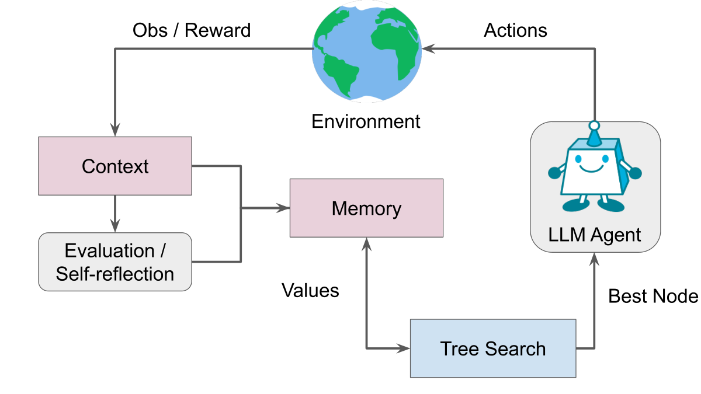

LATS 把模型尝试过的动作放进搜索树，下一步要选哪条路，就得给这些节点一个可以比较的值。我读到回传那部分时停了一下：这里叫 backpropagation，更新的是树上的访问次数和搜索值，没有对语言模型做梯度训练。

[论文](https://arxiv.org/html/2310.04406v3)的选路公式把节点期望回报与探索项相加。已经表现不错的分支值得再试，访问很少的分支也留一些机会。动作执行后得到环境反馈，结果再沿父节点往回更新。文字反思另外保存失败经验，让后续生成候选时能读到。



图源：[论文 Figure 1](https://arxiv.org/html/2310.04406v3#S1.F1)，版权归原作者。回传更新树的统计量，图里的反思记忆保存文本，两条路径都参与后续尝试。

## 均值已经算过一次了

用一个自拟的小例子看回传：某节点访问了两次，当前均值为 0.5，这次得到 1。新均值就是 `(0.5 * 2 + 1) / 3`，约为 0.667。更新时先把旧均值还原成累计量，加上新结果，再除以新次数。

我接着看了[官方仓库这一固定版本的 HotPotQA 实现](https://github.com/lapisrocks/LanguageAgentTreeSearch/blob/853d81614607dd27433faf17c7b0a7d660f95d22/hotpot/lats.py)。`backpropagate` 的普通分支做的正是这个更新：

```python
node.value = (node.value * (node.visits - 1) + value) / node.visits
```

可是往前找 `uct()`，利用项又写成了 `self.value / self.visits`，后面才加探索项。按刚才的例子，回传后的 0.667 进入这里，会再除以 3，变成约 0.222。论文式 (1) 直接使用期望回报 V，没有这次额外除法。这一处不能直接抄过来当作标准 UCT 的实现。

代码还有一层需要留意：`evaluate_node` 也会给 `child.value` 赋模型评估值。因此这个字段并非在所有时刻都只表示累计奖励的均值。我能确认的是，这个版本的回传公式与选路公式放在一起，和论文描述有差别；没有运行对照实验，不能据此推算成绩受了多少影响，更不能把这个观察扩到仓库里的所有任务。

我会先拿一个很小的树检查实现：每次更新后打印 visits 和 value，手算下一次的利用项，再看程序选了哪个孩子。这样至少能分清某个节点受青睐，是因为模型给分高、后续回报好，还是访问次数又参与了一次归一化。
