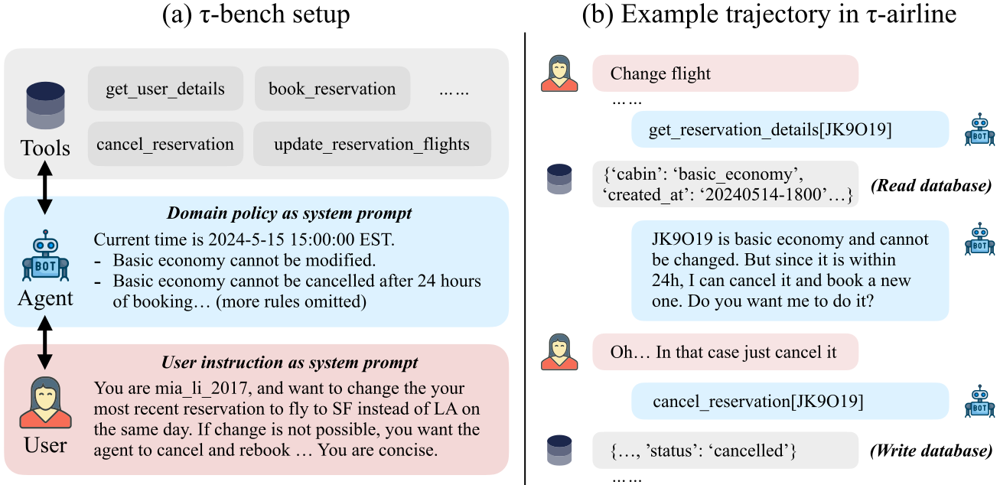

假设同一个客服任务跑了四次，前三次办成，第四次失败。如果从中取两次，我们想知道的是至少有一次成功，还是两次都成功？这两个问题听着接近，算出来差得很远。

这是为解释指标自拟的一组结果。六种两次组合可以全部列出来：

| 两次尝试 | 至少一次成功 | 两次都成功 |
| --- | --- | --- |
| 1、2 | 是 | 是 |
| 1、3 | 是 | 是 |
| 1、4 | 是 | 否 |
| 2、3 | 是 | 是 |
| 2、4 | 是 | 否 |
| 3、4 | 是 | 否 |

前一种是 100%，后一种只有 50%。[τ-bench](https://arxiv.org/html/2406.12045v1) 特别关心后者，用 Pass^k 表示同一任务独立重复多次，全部成功的能力。它和通常问至少成功一次的 pass@k 不一样。客服处理一张订单时，用户得到的是这一次服务，别的尝试办得很好，并不能补上当前这次失败。

论文给助手零售或航空业务规则、数据库和工具，另一个模型扮演用户。用户知道自己的意图，助手需要通过对话问清，评测器另有目标结果。这样任务会包含问需求、查信息、确认和修改状态，不能只看生成的回复好不好听。

图源：[论文 Figure 1](https://arxiv.org/html/2406.12045v1#S1.F1)，版权归原作者。

例如自拟一个订单换两件商品的情况，假定业务规则只允许提交一次换货。助手先办好第一件，随后才问第二件的规格，就可能把这张订单卡住。第一次工具调用成功，和整个用户要求完成，并不是同一件事。这个例子对应的检查对象是最后订单里究竟换了什么，而不是客服有没有说已经办好。

论文奖励检查最终数据库是否符合目标，以及回复是否含指定信息，两项满足才给 1。不同对话路线可以达到同样终态，不过有些过程要求不能完全靠终态判断，例如助手未经确认操作，却碰巧修改成正确结果。作者也说明了这种过程检查的不足，Pass^k 的可靠性仍然建立在当前成功定义上。

计算时，每道任务有 n 次尝试、c 次成功，全部成功的 k 次组合比例为 `C(c, k) / C(n, k)`，再对任务平均。上表就是 `C(3, 2) / C(4, 2) = 3/6`。不能先把所有任务合成一个平均成功率再直接取 k 次方，因为不同任务的难度并不相同。

原生 function calling 的 GPT-4o 在零售和航空的 Pass^1 为 61.2%、35.2%，零售的 Pass^8 已低于 25%。主结果每题至少跑三次，助手温度 0，用户模拟器温度 1，最多 30 个动作，包括对用户说话。[论文设置与结果](https://arxiv.org/html/2406.12045v1#S5)解释了为什么助手温度为零也不代表每次交互会完全一样。

这套指标让我更容易分辨展示和服务的差别。若目标是找一个能完成任务的轨迹，至少成功一次有意义；若要反复处理用户请求，就需要继续看同一个任务到底有多稳定。上表没有增加任何新结果，只是换了问题，原先看起来完美的 100% 就变成了 50%。
