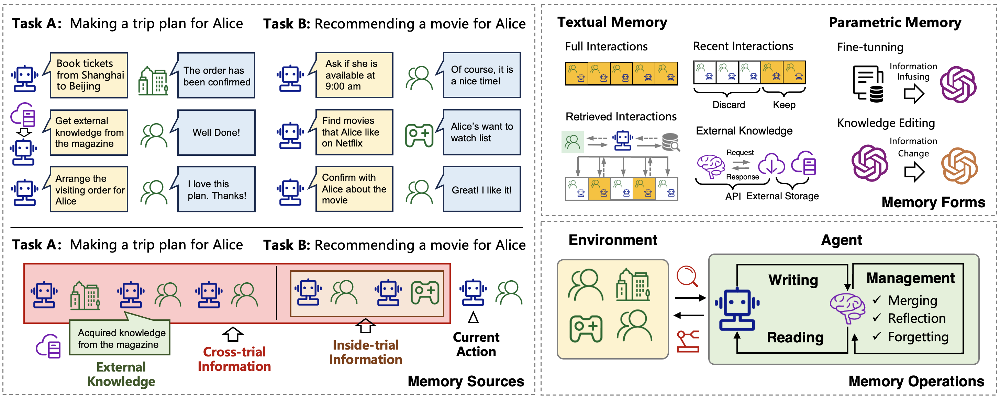

Alice 想在下班后看电影。助手记得她通常晚上九点看，先问时间是否合适；得到确认后，去取她的想看列表，里面有《星际穿越》等几部作品。它还记得 Alice 不在晚上看恐怖片，于是选了《星际穿越》，再问她喜不喜欢。

这是 [2024 年 Agent Memory Survey](https://arxiv.org/html/2404.13501v1#S3) 自带的假设案例。例子很小，我觉得正好可以把几种容易混在一起的信息拆开。刚取回的片单是这次交互获得的，晚上的观影习惯来自过去的记录，Alice 这次说“喜欢”，则又是可以写入的新消息。它们都影响推荐，却不是同一次取得的。

如果只问“助手有没有长期记忆”，看不到中间究竟做了什么。它可能保存了全部聊天，却没取出不看恐怖片的偏好；也可能读到了偏好，整理时又把适用范围删了。这两种失败要改的位置不同。

图源：[论文 Figure 4](https://arxiv.org/html/2404.13501v1#S5.F4)，版权归原作者。左上电影例子按正文应为晚上九点，图中写成上午九点；本文按正文说明。

## “她今晚喜欢”怎么变成了“她喜欢”

论文把操作分成写入、管理、读取。写入可以保存这次确认，读取要找到当前选择需要的片单与偏好。管理夹在中间，可能合并记录、反思或者遗忘。例如原文把交互整理为 Alice 喜欢晚间看科幻片，这已经从一次对话变成更概括的描述。

我读到这里会想给那条偏好留一个原文入口。一次说喜欢《星际穿越》，并没有逐项回答是否喜欢所有科幻片、是否每晚都愿意看。这个概括用于说明管理操作很直观，真拿来推荐时，我还是想知道它来自几次选择。将来 Alice 说今晚想看喜剧，也应该能更新当前安排，不必先和一条写得过于笃定的偏好争论。

存完整对话好回查，存短事实便于检索，两种形式可以一起用。综述还讨论参数形式的记忆，例如微调与知识编辑。对这个电影清单，我倾向先保留文本：哪次对话说了什么，修改了哪条偏好，都能直接找到。

## 怎么知道是记忆帮上了忙

如果 Alice 在最后一个问题里重复了“不看恐怖片”，助手答对，也可能只是读到了眼前这句话。要检查以前的记忆有没有用，就得把这次重复提示去掉。论文在[评估部分](https://arxiv.org/html/2404.13501v1#S6)区分直接评估记忆和通过完整任务间接评估；后者更接近实际使用，但也更难定位是哪一部分出了力。

我会沿着这个案例补两道小检查，作为自己的测试想法：一回只给新片单，看它能否找回旧偏好；另一回明确说“今天例外”，看它会不会仍机械地套用旧记录。若第二回失败，就回去看这次确认有没有写入、旧条目是否仍被当作当前约束。电影可以重新选，记忆怎样更新却得在这一步说明白。
