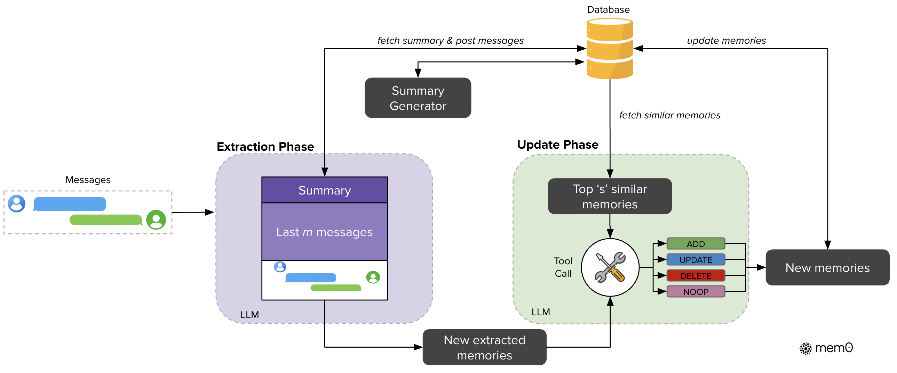

助手已经记着一个人喜欢打板球，后来又知道他喜欢和朋友一起打板球。要不要再存一条？如果全都追加，稍微换个说法就多一份近似记忆；如果每次覆盖，又可能删掉本来还成立的信息。Mem0 在写入之前做一次比较，决定这句话究竟带来了什么变化。

[官方固定版本的更新提示](https://github.com/mem0ai/mem0/blob/c7ee362aff94a369af70f13f2b4f853f6793ff4c/mem0/configs/prompts.py) 有几组例子，下面按意思整理。它们是提示中的示范，不是实际用户数据：

| 旧记录 | 新信息 | 示例中的处理 |
| --- | --- | --- |
| 用户是软件工程师 | 名字叫 John | 新增姓名，原职业记录保留 |
| 喜欢打板球 | 喜欢和朋友一起打板球 | 更新原记录，保留原 ID |
| 喜欢芝士披萨 | 不喜欢芝士披萨 | 删除原来的偏好记录 |
| 名字叫 John | 名字仍是 John | 不作修改 |

代码把四种操作写作 `ADD`、`UPDATE`、`DELETE`、`NONE`，最后一个表示无需变更。板球那条增加了信息，没有推翻原来的兴趣；姓名重复则连补充都没有。这种比较比一收到消息就塞进向量库多做了一步，但也减少了以后检索出来一堆相近句子的情况。

披萨还有另一个有意思的示例：原来喜欢芝士披萨，新得知喜欢鸡肉披萨，提示把两者合起来保留。因为没有说不喜欢芝士，不能自动把新偏好理解成替换。反过来，明确说不喜欢，就不能继续当作原偏好使用。区分这些句子依靠模型的判断，操作枚举只是让判断结果有一个程序可以执行的形式。

图源：[论文 Figure 2](https://arxiv.org/html/2504.19413v1#S2.F2)，版权归原作者。

[论文 v1](https://arxiv.org/html/2504.19413v1) 的抽取器会读当前消息对、近期消息和持续更新的摘要，近期窗口设为 10 条；候选事实再召回 10 条相关旧记忆，交给更新步骤，使用 GPT-4o-mini。这里检索旧事实是为了决定怎么写入，和用户提问以后检索答案材料不是同一次操作。

这也意味着抽取时删掉一个“不”或时间条件，更新阶段可能认真执行一个错误判断。比如“这周暂住某地”若只抽成住在那里，操作层选择 UPDATE 也不能把丢失的这周补回来。先检查抽出来的句子，再查所选操作，才能知道一次记忆改错发生在哪。

论文在 LoCoMo 上也比较了压缩记忆和完整历史。Mem0 的总体 judge 分数为 66.88，全历史为 72.90；总响应 p95 延迟则约为 1.44 秒和 17.12 秒。这里省下的是问答时的等待，更新记忆本身仍要持续调用模型。[实验结果](https://arxiv.org/html/2504.19413v1#S3.T1)给出了这项取舍。

把每次更新的决定记录下来，会更方便排错。板球那条究竟是补充，披萨那条究竟是冲突，都能拿新旧句子对照；只剩最后一份干净的画像时，反而很难知道它是从哪次误读长出来的。
