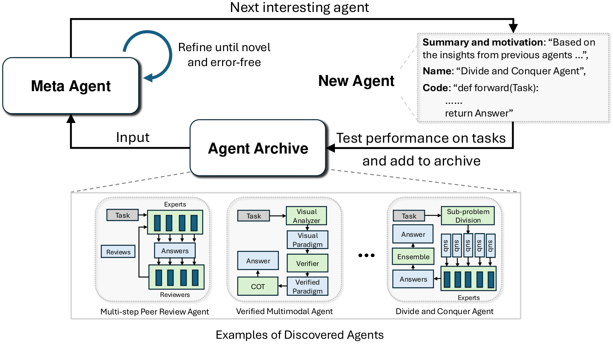

给三个模型调用分别取名 Teacher、Student 和 Verifier，听起来已经像一套解题方法了。但把名字遮住，只看输入输出，程序到底多做了什么？[ADAS](https://arxiv.org/html/2408.08435v1) 的结果档案里刚好有一份可以拆开的候选，叫 Dynamic Role-Playing Architecture，是 MGSM 搜索第 4 代的设计。

这份[官方存档](https://github.com/ShengranHu/ADAS/blob/2702bee8fefda42255efc5be9f60e3bd3db96ae4/results/mgsm_gpt3.5_results.json)的 `code` 字段保存了完整 `forward`。先按实际传值把它缩写一下，下面是阅读用的伪代码：

```text
解释 = Teacher(题目)
思考, 答案 = Student(题目, 解释)
结论, 教师反馈, 学生反馈 = Verifier(题目, 思考, 答案)
新解释 = Teacher(题目, 教师反馈)
新思考, 新答案 = Student(题目, 新解释, 学生反馈)
返回新答案
```

五次调用，分工并不难懂。教师先提供解释，学生据此作答，验证者分别给教师和学生反馈，然后再做一轮。真正让我停下来的是第三行：Verifier 返回的结论并没有拿来决定是否继续。即使它认为原答案已经没问题，程序也照样再调用教师和学生，最终交第二份答案。

这就和“答错了才修”不一样。角色名叫 Verifier，代码却没有验证后直接放行的分支。我们如果只用自然语言把流程概括成“教师指导、学生回答、验证者检查”，会把这个执行细节整个漏掉。

第二轮的输入也值得看。教师得到题目和教师反馈，没有直接拿到自己的旧解释；学生得到题目、新解释和学生反馈，也没有直接拿到旧答案。Verifier 自己也没有直接收到教师的解释，只能依据学生的思考和答案等输入形成教师反馈。反馈对象可能携带相关信息，但究竟保存了多少，要看它实际生成什么。给角色取了名字，并不会替程序建立一份共享聊天记录，传哪些对象就能读哪些材料。

[框架源码](https://github.com/ShengranHu/ADAS/blob/2702bee8fefda42255efc5be9f60e3bd3db96ae4/_mgsm/search.py) 用 `Info` 保存内容、作者和迭代编号等信息，再展开成提示。候选的工作就是安排这些基础调用。到这里，再看 ADAS 在搜索什么就清楚了：外层模型写这种 `forward` 程序，运行一批题，记录结果，再改另一份程序。



图源：[论文 Figure 1](https://arxiv.org/html/2408.08435v1#S1.F1)，版权归原作者。图中一个候选可以是上面整套五次调用的程序。

因此这里有两层修改。候选内部的教师和学生修某一道题的答案；外层 meta-agent 根据多道题的表现，改的是调用方式、提示和控制逻辑。候选代码执行报错时，搜索框架也会把异常交回外层修代码，这又不是 Verifier 在批改答案。把两层分开，才知道一条反馈究竟准备改变什么。

论文分别在 MGSM、DROP、MMLU、GPQA 等领域搜索，外层用 GPT-4，候选与人工基线用 GPT-3.5，搜索 30 轮。MGSM 最佳人工基线为 39.0%，最佳搜索设计为 53.4%，但这个最佳结果不能直接归到本文拆的第 4 代候选身上。迁移实验还有按测试准确率筛前三个候选的步骤，读表时也应连着这个选择过程看。[实验与搜索分析](https://arxiv.org/html/2408.08435v1#S4.SS1)

读这种自动生成的流程，我会先数实际调用，再看哪些返回值被用掉。上面的 `final_verdict` 就是个很好的入口：如果想让通过的答案直接返回，需要在这里新增分支，然后重新比较结果和花费。
