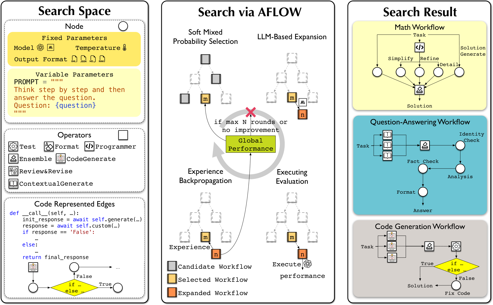

AFlow 论文附录给出了一份用于 MBPP 的搜索结果，流程不复杂：生成三个代码候选，选出一个，拿去测试，失败了再修。这比“模型自动优化工作流”这句话好理解多了，也可以直接检查它到底优化出了什么。

下面按[附录 B.1](https://arxiv.org/html/2410.10762v4) 中的执行顺序整理，省略了具体类名和提示参数：

```text
依次生成代码候选 1、2、3
将三个候选交给 ensemble 选择
测试选中的代码
  测试成功 → 返回测试后的 solution
  测试失败 → 把题目、失败代码和错误交给模型修复 → 返回修复稿
```

三个候选是在 `for` 循环里逐个 `await` 的，所以这份代码并没有让三次生成同时运行。更容易看漏的是末尾：失败后的修复稿直接返回，没有再经过上面的测试。修复提示确实要求保持函数名与签名、针对错误修改，但模型交出修复稿，和测试确认修好了之间仍然少了一步。

我觉得这是读自动生成工作流时很值得做的检查。图上有 Test，听起来像最后的答案已经测过；沿实际返回路径走一遍，会发现有一条路径绕过了最后一次测试。要在自己的代码里使用这套思路，就可以先决定修复后是否再跑测试、失败允许重试几次，而不是把“有测试节点”当成整个输出的性质。

这份 MBPP 流程在搜索第十四轮找到。AFlow 怎么找它？先给一组可调用的 Operators，例如代码生成、评审修订、测试和集成，再让优化器修改连接这些操作的代码与提示。一份完整工作流才是搜索树中的一个节点。它被选中以后生成下一份候选，跑验证题，把相对上一份好在哪里、差在哪里记下来，供后续继续改。



图源：[论文 Figure 3](https://arxiv.org/html/2410.10762v4#S3.F3)，版权归原作者。这棵树是在找解题程序，并非在一道题内搜索几个中间答案。

论文的表示能描述模型、温度、输出格式等属性，实际实验主要改提示和连接代码，模型等设置固定。优化器用 Claude 3.5 Sonnet，主实验执行器用 GPT-4o-mini，搜索 20 轮。数据按 1:4 划分验证和测试，作者先在验证部分跑空模板五次，再挑波动较大的题做搜索验证集；新候选也重复运行五次，比较均值和波动。[搜索设置](https://arxiv.org/html/2410.10762v4#S4) 的这些步骤说明，外层并非看一次回答顺眼就把流程留下。

六项主任务中，AFlow 的平均分为 80.3，人工 CoT Self-Consistency 为 76.0，相差 4.3 个点；摘要写的约 5.7% 是相对提升。这个平均包含数学正确率、问答 F1 和代码 pass@1，想判断自己的代码任务适不适合，还是要回到对应那一列，而不能只读平均。[实验结果](https://arxiv.org/html/2410.10762v4#S5.SS1)

官方仓库的 [README](https://github.com/FoundationAgents/AFlow/blob/3f457218fc716093fe53f6df8a5d5e6379d66346/README.md) 提供各轮实验包。只打开仓库里 round_1 的初始文件，看到的还不是论文找到的最终工作流。
