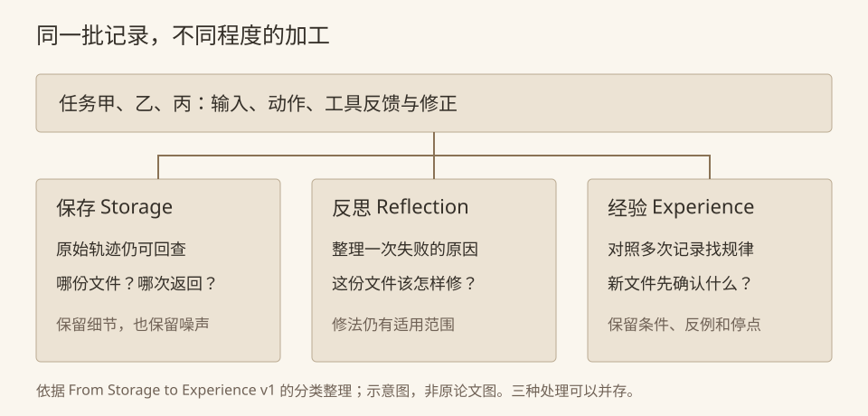

`03/04/2026` 是三月四日，还是四月三日？单看这个字符串没法决定。假设一次导入先按月/日解析，后来查看数据字典，才知道这份文件采用日/月。修好以后给 Agent 留一句“下次按日/月解析”，看起来完成了反思，碰到美国来源的新文件又会出错。

这是我读 [From Storage to Experience](https://www.preprints.org/manuscript/202601.0618/v1) 时自拟的例子。它让我觉得，保存失败经历之前，最好先想清楚下次要怎样使用。连同原始输入保存下来当然有用，但一大段报错和修复记录被再次检索到，模型还得重新判断哪些是当时的猜测，哪些已经得到证实。

我会先把这次记录写得很窄：

```text
文件 A 的日期字段采用日/月/年。
依据：该文件附带的数据字典。
原解析器按月/日读取，导致 03/04/2026 被读成三月四日。
修复只适用于文件 A 及使用同一字段规范的文件。
```

这样至少不会把“文件 A 的格式”悄悄变成所有日期的默认格式。记录长了一点，我觉得值得，尤其最后一句。下次遇到文件 B，可以先找它自己的字段规范，没必要继承 A 的结论。

论文用 Storage、Reflection 和 Experience 讨论记忆从保存到加工的不同程度。这里看的版本是 2026 年 1 月 8 日的 v1 预印本，主要做分类与定性讨论。按它的框架，原始导入轨迹可以放在 Storage；上面这条针对失败的修正已经经过 Reflection。想再抽成可迁移的 Experience，就需要考虑其他文件，不能只把文件名删掉。



依照论文分类自行绘制，非原论文图片。例子仅用于解释，依据：[v1 预印本](https://www.preprints.org/manuscript/202601.0618/v1)。

比如文件 B 确实采用月/日，文件 C 里又混了不同来源。把这几种情况并排考虑后，我能写出一条稍微通用的检查顺序：先查字段规范；没有规范，再找能区分顺序的样本；仍有歧义就保留原值，等待确认；发现混合来源，不把一行的格式推广到整列。这是说明用规则，还没有运行验证。它保留了暂时无法决定的情况，也没有承诺所有日期都能自动导入。

写到这里，我反而不急着把原始轨迹删掉。将来某份文件推翻了这条规则，还需要知道它最初依据哪些样本。短规则好检索，原记录方便追查，两份东西可以一起保存。论文也没有要求所有系统按三个阶段依次升级，或用加工后的经验替掉全部日志。

下一步若要验证这条规则，我会留一批没参与整理的文件，里面既有明确规范，也有歧义和混合格式。旧文件 A 已经修好，再跑它只能检查修复有没有退步；要看经验能不能再用，还是得让文件 B、C 这样的新情况进来。对于那个孤零零的 `03/04/2026`，能保留原值并说明缺什么材料，也是我愿意接受的结果。
