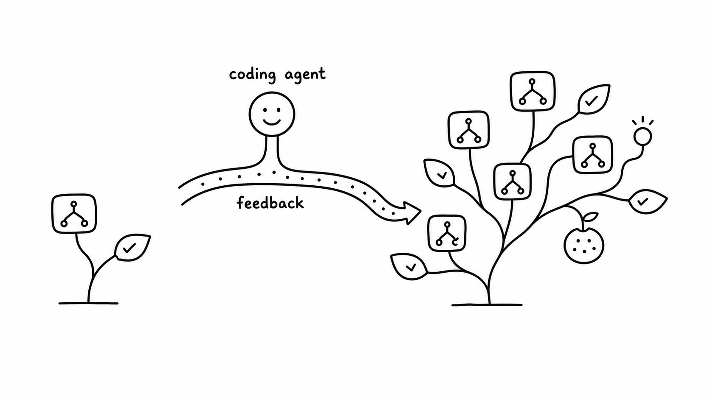

作者记录的 387 分 Breakout 版本挺有意思：球能接住，游戏没结束，分数却不怎么动了。挡板把球送回一条重复路线，剩下的砖一直碰不到。控制器在接球这件事上已经做得不错，继续只调接球精度，看起来不会解决眼前的问题。

Jiayi Weng 在 [Learning Beyond Gradients](https://github.com/Trinkle23897/learning-beyond-gradients/blob/01505855120ba5fe801fc0f701b42b7c4594ff81/learning-beyond-gradient.en.md) 里保留了这次迭代。他原本想给 EnvPool 找便宜、可复现的测试策略，让环境走到比随机动作更有信息的状态。编码 Agent 看运行记录，再修改策略代码，作者把这种过程叫 Heuristic Learning。以下实验和录像都来自原作者，我没有复现。

本文为后续修订稿，5 月 6 日仅保留作原归档日期；以下引用固定在英文稿 2026 年 5 月 11 日的提交。[该英文文件首次入库](https://github.com/Trinkle23897/learning-beyond-gradients/commit/0581e0b0c1b8)为 5 月 8 日，晚于本文归档日期。

## 先让球换一条路线

原文处理停滞的办法很直接。连续很久没有奖励，就给预测落点增加偏移，而且让偏移换方向、换幅度，试着打破周期。接球程序仍在每一步执行；修改这些规则的 Agent 则在一轮运行之后看反馈，两者的速度和职责不同。

加入这项处理后，记录里的分数从 387 到了 507。可以对照作者保留的[387 分录像](https://github.com/Trinkle23897/learning-beyond-gradients/blob/01505855120ba5fe801fc0f701b42b7c4594ff81/atari/breakout/heuristic_breakout_score387_tunnel0_render210x160.mp4)和[507 分录像](https://github.com/Trinkle23897/learning-beyond-gradients/blob/01505855120ba5fe801fc0f701b42b7c4594ff81/atari/breakout/heuristic_breakout_score507_stuckbreaker_render210x160.mp4)看。只看两个数字，会漏掉修改的理由：前一个版本活着但停滞，后一个版本有意改变球路。

随后出现的是高速低球问题。普通的落点追踪让挡板提前过头，作者记录加入 `fast_low_ball_lead_steps=3` 后得到了 839 分。继续往上改时，有些参数尝试没有用，最后有效的一处修改发生在后半场：球离挡板还远时可以扰动，接近时逐渐释放偏移。原文摘出的核心三行是：

```python
if score >= 432 and stuck_release_horizon_steps > 0:
    release_ratio = clip(steps_to_paddle / stuck_release_horizon_steps, 0.0, 1.0)
    offset *= release_ratio
```

这里的 `steps_to_paddle` 越小，偏移就越小。我喜欢这几行把“差不多该收手了”写成了一个能检查的条件。扰动帮助球碰到新砖，到了接球前还继续偏，就会把挡板拉走。作者另外补了动作与挡板位置之间的一步延迟补偿，最终记录到了 864 分。代码和各阶段重跑命令都在[原文附录](https://github.com/Trinkle23897/learning-beyond-gradients/blob/01505855120ba5fe801fc0f701b42b7c4594ff81/learning-beyond-gradient.en.md)。



配图来自 Jiayi Weng 的原文，版权归原作者，不是本站实验截图。

## 14,504 步从哪里开始算

后面把控制器从 RAM 状态读取迁到纯图像输入，也很值得分开看。几何控制、打破循环和后期释放偏移，已经在 RAM 版本里摸索过；图像版本接着替换状态读取层，用 RGB 检测球、挡板等信息。约 14,504 个环境步数对应这段局部迁移，不能写成从零发现整套策略的花费。

387、507、839、864 同样是具体中间版本的记录，不是任意种子上的平均成绩。慢循环里还用了已训练语言模型的知识，因此“执行策略是普通程序”和“整个过程没有使用神经网络”也差很远。

原文留下了各阶段代码和重跑命令，可以对照那几行偏移释放，检查球接近挡板时偏移是否真的减小。前面为打破循环加上的动作，到了接球前必须及时收回。
