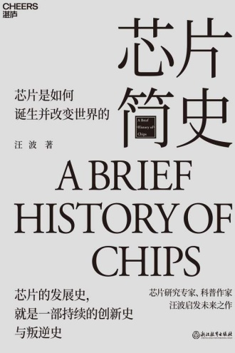

芯片里能放很多晶体管，这个说法太熟了，反而容易忽略一个麻烦：这么多元件做好以后，怎么连接？如果还要把它们一个一个接线，元件本身做得再小，连接的工作也会越来越难。

汪波在《芯片简史》写诺伊斯时，把这个问题讲得很具体。他的思路是把多个元器件做在同一块硅片上，连元件间的互连也一并纳入制造工艺。这样再看“集成”两个字就有意思多了。我们很容易把它想成缩小、挤在一起，实际还要解决挤在一起以后怎么组成一个能工作的电路。[作者提供的第四章摘录](https://wangbo66.com/books/芯片简史) 可以直接读到这部分。

同一页前言还讲到杰·拉斯特在仙童的项目。1960 年，副总裁因为项目已经花钱、却没有带来收益，要求把集成电路项目撤掉。站在今天看，这个判断很容易显得荒唐，毕竟我们已经知道后来的结果了。但我不太想只把它读成一个“领导不懂技术”的故事。当时该继续投多少、再给多久，跟今天回看历史时说一句应该坚持，完全是两种难度。

书封：[豆瓣阅读，湛庐文化提供](https://read.douban.com/ebook/426248792/)。作者另有一篇[编创后记](https://wangbo66.com/2023/1257)，讲他为什么想写开创者的处境，可以和前言放在一起看。
