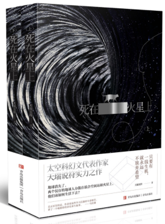

《死在火星上》开头就把退路拿走了。地球消失，唐跃在火星昆仑站，麦冬在轨道上的空间站，旁边还有机器人老猫。要是普通的太空事故，至少还能等地面想办法，这里连地面本身都没有了。

我对这个设定最直接的感觉倒不是宇宙有多大，而是两个人隔得真难受。能说话，知道对方还在，可对方缺食物，自己不能拎着东西过去；同在火星附近也没有什么用，一个在地表，一个在轨道，运一次补给仍然是航天任务。

故事里唐跃把有限物资分出一半，和老猫冒着沙暴风险把补给送给麦冬。这一段在[青岛版的介绍](https://books.google.com/books/about/死在火星上.html?id=nNk1zwEACAAJ)里也提到了。分一半这个动作很重，因为后面没有一个仓库还会送来下一批。送出去多少，自己就少多少；不送，对面的人又确实在等。把它写成一道运输问题可以算很多东西，但开始计算以前，就已经做了一个很难的决定。

唐跃和老猫接下来还得把东西运上去。这个安排让人物的关系落到了实际行动里：答应帮忙以后，要一起冒险，东西能不能送到也还没有保证。我觉得这里已经足够难受了，两个人明明还联系得上，却连分一点吃的都得跨过这么多困难。

书封与作品介绍：[中国作家网](https://www.chinawriter.com.cn/n1/2022/0325/c405080-32384082.html)。
