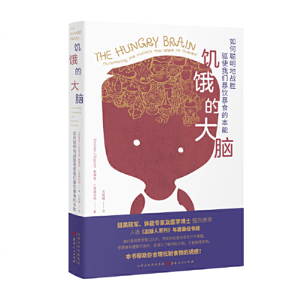

“管住嘴”真是一句省事的话。谁都能说，说完就把剩下的困难全交给那个要减肥的人。《饥饿的大脑》愿意花一本书的篇幅解释这些困难，所以即使最后给出的建议不怎么新鲜，我还是觉得它值得读。

书里最有意思的是，吃够了和不想再吃了，原来并不总是一起发生。斯蒂芬·J.居耶内特讲食物奖励、饱腹感，也讲身体如何调节长期的能量储备。面对同一种食物，兴趣可能慢慢下降，换一种味道又会想吃；食物好不好拿到、要花多少力气得到，也会影响行为。这样看，“甜点还有另一个胃”这句玩笑就没有那么离谱了。书的好处在于把这些平常得不能再平常的念头拆开，不要求读者先承认自己贪吃，再开始讨论。

我觉得比零食诱惑更值得看的是体重下降之后的部分。作者谈到瘦素等信号如何参与调节，身体会对减少的脂肪储备作出反应，饥饿感也可能更强。减下来以后为什么还那么难维持，到这里才真正成为一个需要解释的问题。按照“少吃一点就行”的说法，维持体重仿佛只是把成功的方法继续做；书却让人看见，前后的处境本来就可能不同。对反弹的人少一点轻蔑，至少是这个解释该带来的结果。

它没有特别急着把某一种营养素揪出来当罪魁祸首。食物本身、睡眠和压力都在讨论范围里，章节之间能接起来，这比各讲一个冷知识舒服。不过神经机制确实占了不少篇幅，如果只想要一份下周照着吃的菜单，大概会觉得作者绕了很远。我的看法恰好相反：那些不够简单的解释才值得花时间，最后的建议反而没有必要抄得那么认真。

而且，少接触诱人的食物、自己准备饭菜，知道这些办法和有条件这么生活，仍是两回事。下班以后还剩多少精力，厨房能不能用，都不会因为弄懂了一个脑区而自动解决。[Scott H Young 的书评](https://www.scotthyoung.com/blog/2019/04/11/hungry-brain-review/)谈到了可口与便利很难割舍。这也让我想到，便利对有些人来说确实是必要条件。真要把建议用起来，恐怕还得替不同的生活多想几步，不能解释完为什么想吃，就默认大家已经有办法改变。

居耶内特还在自己的网站上列了[勘误](https://www.stephanguyenet.com/mistakes-page-for-the-hungry-brain/)，包括英文版里混淆“惩罚”与“负强化”、写错实验饮食条件的地方。这个做法让我对他多了一点好感。这样的书会改变读者理解自己身体的方式，讲错了就该把哪里错了说清楚，不能只靠“有科学依据”五个字撑着。

另可读 [Ravi Das 对全书研究内容的评论](https://www.bap.org.uk/articles/book-review-the-hungry-brain/)。

[书封及中文版信息](https://xbsu.com/42366-9787203113713.htm)。
