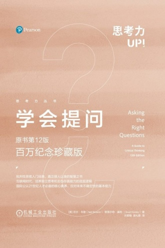

“八成用户觉得有效，所以这个工具值得买。”先假设有人这样推荐一件东西，这句话是我为笔记编的，不是《学会提问》里的原题。

第一眼看，理由和结论都有：八成觉得有效，是理由；值得买，是结论。可把两句话分别写出来，就会发现中间少了不少东西。有效到什么程度，价格是多少，想买的人需要解决什么问题，这些都还没出现，购买建议已经替我们做完了。

《学会提问》前面几章就从论题、结论和理由讲起，再讨论歧义与假设。[第 12 版目录](https://www.pearson.com/en-us/subject-catalog/p/Browne-Asking-the-Right-Questions-A-Guide-to-Critical-Thinking-Subscription-12th-Edition/P200000002371/9780137501731) 里的顺序很朴素，我觉得这种慢一点的拆法反而好用。急着找谬误之前，总得先确认对方究竟说了什么。

继续看“有效”。如果有效指界面容易操作，和完成任务更准确不是一回事；如果指偶尔有帮助，又和每天能省一小时差得很远。再看“用户”，十位付费用户的回答、随机邀请的大量试用者，以及只留下好评的人，都可以被一句用户概括掉。它们未必会得出相同结论，但问题不是看到数字就认定有人作假，而是现有信息还没把分母和标准交代清楚。

即使这些都补全，八成用户确实省了时间，也还可以继续问：和什么比，原来的工具是否也能做到，省的时间值不值这个价。这时买不买才开始和自己的需求接上。我们不需要因为提出问题，就一定把推荐否定掉；也可能问完以后发现，这个工具确实适合，只是原来的理由写得太省事。

书里把吸收材料和检验理由比作海绵与淘金，两者得接着用。连推荐者的意思都没读明白，问题也会问偏；理解了以后，再检查理由能不能推到购买建议，才算讨论到同一件事上。

书封与中文版资料：[豆瓣阅读，机械工业出版社提供](https://read.douban.com/ebook/454005195/)。
