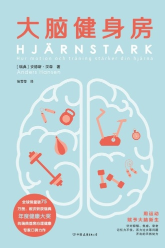

安德斯·汉森真的很想让读者去运动。《大脑健身房》谈压力，谈注意力，谈到记忆和创造力，兜兜转转又把运动请出来。已经认可运动好处的人，可能会嫌他重复，我也觉得有些地方可以短一点。不过，对不关心减肥、不想练肌肉的人，这个劝法还是有吸引力：花时间动一动，也可能让用脑的时候舒服一些。

我比较喜欢记忆那部分。书里用运动研究讲大脑在成年以后仍然能发生变化，其中涉及一项持续一年的老年人有氧训练试验。研究里，一组做有氧运动，一组做拉伸等活动，研究者用影像比较海马体体积的变化，有氧组出现增长，对照组则缩小。这比单纯说“运动让人年轻”有意思，也能看出时间是怎么花进去的。一年里持续做的事，最后有可比较的测量，比只听见“对记忆好”更让人想了解下去。

创造力那章也值得看。走路与坐着完成任务的差别，听上去很贴近日常，不过顺着[书中提到的斯坦福研究](https://aaalab.stanford.edu/assets/papers/2014/Give_your_ideas_some_legs.pdf)看，找出多种新用途和寻找一个正确答案，效果并不相同。这个细节反而让我更愿意接受它：出去走走适合某些卡住的时候，但不用因此把所有脑力活动都改成边走边做。

也正因为这些细节好看，我对书里不断回到运动好处的写法有点不耐烦。记忆、注意力、创造力原本各有值得展开的问题，连着看下来，却容易只剩下一个去运动的印象。[有读者觉得核心建议一句话就够了](https://www.dedao.cn/ebook/reviews?id=z4R9BQ7pP4ZEaXYkx8KvRdljeyqo60881x101m2bMAO9NnDL7gBGQr5VzJqrvmEV)，我没那么苛刻，解释为什么本来就需要篇幅，只是解释和劝说的比例可以再调一调。

不过，“一句话就够了”的书评也让我想了想：知道运动有好处，和觉得这件事值得占掉自己一个小时，确实不同。忙的时候，活动身体很容易成为日程里最先被划掉的事。汉森给不关心身材的人找了好几种理由，把这段时间再留回来，重复也就有了用处。我对这本书的评价差不多就在这里，科普读物里不算特别耐读的一本，但要找点出门活动的动力，它挺合适。

读者评价：[《为了美好大脑》](https://book.douban.com/review/10297295/)；记忆部分的原研究：[Erickson 等，2011](https://pmc.ncbi.nlm.nih.gov/articles/PMC3041121/)。

[书封来源：豆瓣阅读](https://read.douban.com/ebook/448537026/)。
