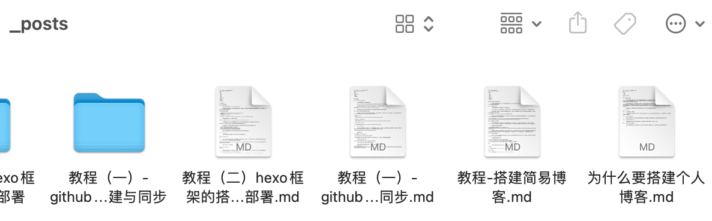

## 1. 准备环境

这篇旧文的目标很简单：用 Hexo 和 GitHub Pages 搭一个能公开访问的个人博客。它不是从零写一套网站系统，而是先把写作、生成静态网页、托管上线这条路径跑通。

当时的环境要求也很轻：本地需要 Git 和 Node.js。无论是 macOS、Windows 还是 Linux，只要能安装这些基础工具，就可以继续往下走。

## 选择托管平台

个人博客的搭建方式很多，静态博客框架也很多。原文选择的是 Hexo：它基于 Node.js，把 Markdown 内容生成静态页面，再交给托管平台发布。

托管平台可以选择 GitHub Pages，也可以选择其他支持静态页面的平台。原文使用 GitHub，因为它同时提供代码仓库和 GitHub Pages，适合把本地生成的博客文件同步到远端。

如果还没有 GitHub 账号，可以先参考原文保留的注册教程：

[GitHub 注册教程](https://segmentfault.com/a/1190000040770337)

注册完成后，需要熟悉仓库的基本操作。原文后续把 GitHub Pages 仓库当作静态网页的存放位置，并把创建流程拆到了单独文章：

[GitHub Pages 创建教程](/blog/教程（一）-github仓库的创建与同步/)

## 部署本地博客

Hexo 需要 Node.js 运行环境。它会在本地读取文章和配置，生成静态文件；再通过 Git 或部署插件，把生成结果发布到远端仓库。

这一步真正要确认的是两件事：

- 本地 Hexo 项目能正常生成页面；
- 生成后的静态文件能同步到 GitHub Pages 对应仓库。

原文没有在这篇总览里展开命令，而是把安装、配置和托管步骤放到了下一篇教程：

[Hexo 框架部署配置以及托管教程](/blog/教程（二）hexo框架的搭建及部署/)

完成这一步后，博客已经可以访问。主题、美化、评论、统计这些内容都属于后续优化，不应该挡住第一轮上线。

## 配置主题

Hexo 的主题生态很丰富。原文提到，选择主题时可以先看官方文档，再决定是否继续改细节。这里更适合把主题理解成“展示层”：它改变博客的样式和交互，但不改变写作和发布的基本流程。

原文列过几个主题方向：

- Maupassant：体积较小，在不同尺寸设备上都有适配；
- Matery：采用 Material Design 和响应式设计；
- pure：包含多语言、第三方评论、豆瓣书单、打赏等扩展能力。

原文重点给了两个主题文档入口：

[NexT 主题配置使用教程](https://theme-next.iissnan.com/getting-started.html)

[Butterfly 配置使用教程](https://butterfly.js.org/posts/21cfbf15/)

主题可以慢慢调。更稳妥的顺序是：先让博客能跑起来，再让它能部署，最后再做视觉和功能配置。

## 开始写文章

博客搭好以后，真正长期使用的是写作流程。原文建议先准备 Markdown 编辑器，再通过 Hexo 命令创建文章、草稿等内容。

当时提到的编辑器包括 MarkdownPad、BookPad、小书匠、Typora 等。编辑器本身不是关键，关键是用 Markdown 写出内容，并让 Hexo 能识别、生成和发布。

原文把 Markdown 语法、编辑器下载、`hexo new` 创建文章，以及发布新文章的流程放到了单独教程：

[如何利用 Markdown 文本编辑器编写文章并利用 Hexo 命令上传新的文章](/blog/教程（三）-编写上传自己的博客文章/)

## 处理文章图片

Markdown 里的图片通常通过链接或相对路径引用。生成静态页面时，如果图片文件没有放到正确位置，线上页面就可能加载失败。

原文没有在这篇文章里展开每一种处理方式，而是把问题和方案放到了后续教程：

[解决博客文章图片无法显示问题](/blog/教程（四）-解决博客文章中图片上传失败问题/)

## 小结

这条入门路径可以压缩成四步：

1. 注册 GitHub，并准备 GitHub Pages 仓库；
2. 在本地安装和配置 Hexo；
3. 选择主题，但不要让主题配置挡住上线；
4. 用 Markdown 写作，并处理好图片路径。

搭建博客不是终点。它只是把写作入口从本地文件夹搬到公开页面上，后面真正值得积累的是日常、学习过程和解决问题的记录。
