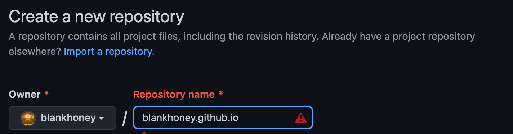
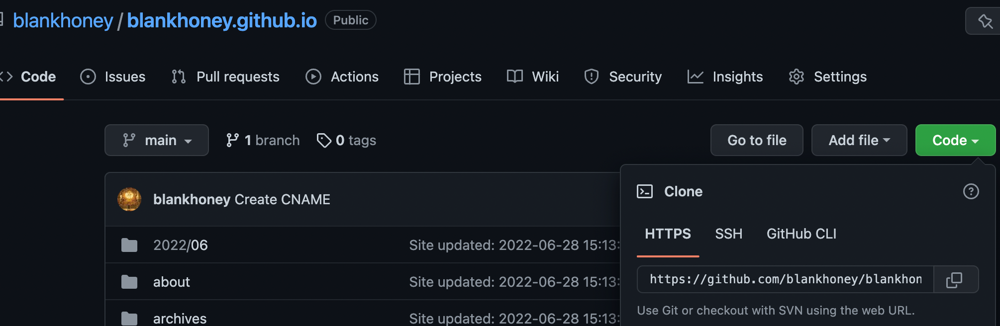

这篇是早期博客搭建教程的第一步：先把 Git、GitHub、SSH 和 GitHub Pages 仓库准备好。后面的 Hexo 部署、文章发布、图片路径处理，都建立在这个仓库已经能正常同步的前提上。

## 先分清 Git 和 GitHub

Git 是本地版本控制工具，用来记录文件变化、提交历史和分支状态。它不是博客框架，也不是网站托管服务，只负责帮你管理代码或文档的版本。

GitHub 是远程代码托管平台。你可以把本地 Git 仓库推送到 GitHub 上，作为备份、协作入口，也可以借助 GitHub Pages 发布静态网页。

如果还没有安装 Git，可以先按系统环境完成安装，再确认命令可用：

```bash
git --version
```

安装完成后，建议先熟悉几个基础动作：查看状态、添加文件、提交修改、设置远程仓库、推送到远端。搭博客时不需要一开始就掌握复杂分支模型，但至少要知道每次发布前自己正在提交什么。

## 用 SSH 连接 GitHub

本地仓库要推送到 GitHub，需要先建立认证关系。常见方式有 HTTPS 和 SSH。早期教程里推荐 SSH，是因为配置完成后，日常推送不需要反复输入账号密码，适合长期维护博客仓库。

大致流程是：

1. 在本机生成 SSH Key。
2. 复制公钥内容。
3. 把公钥添加到 GitHub 的 SSH Keys 设置中。
4. 在终端测试能否连接 GitHub。

可以参考 GitHub 或常用 Git 入门文档完成这几步。需要注意的是，私钥只能留在本机，不要提交到仓库，也不要发给别人。

## 创建 GitHub Pages 仓库

普通 GitHub 仓库可以随意命名，但用户主页类型的 GitHub Pages 仓库有固定格式：

```text
用户名.github.io
```

例如 GitHub 用户名是 `blankhoney`，仓库名就应写成：

```text
blankhoney.github.io
```

早期截图中创建仓库的位置如下：



这里有两个容易踩坑的点。

第一，仓库名必须和 GitHub 用户名对应。没有绑定自定义域名时，`用户名.github.io` 也会成为默认访问地址的一部分。

第二，分支名要看仓库的实际默认分支。现在新仓库通常使用 `main`，旧教程里常见的 `master` 不一定适用。后续配置部署分支、推送命令或 Hexo 发布目标时，都要和仓库实际分支保持一致。

仓库创建完成后，可以在仓库页面看到远程地址：



## 把本地内容同步到远程

如果本地已经有项目目录，可以在项目根目录初始化 Git，并把远程仓库地址关联上：

```bash
git init
git add .
git commit -m "Initial commit"
git branch -M main
git remote add origin git@github.com:用户名/用户名.github.io.git
git push -u origin main
```

如果 GitHub 上的仓库已经包含 README 或其他初始文件，更稳妥的做法是先克隆远程仓库，再把本地文件放进去提交。这样可以减少本地历史和远程历史不一致带来的冲突。

```bash
git clone git@github.com:用户名/用户名.github.io.git
cd 用户名.github.io
```

无论采用哪种方式，提交前都先看一眼状态：

```bash
git status
```

确认没有把密钥、Token、环境变量、临时缓存或不该公开的文件一起提交。GitHub Pages 仓库往往是公开仓库，这一步不能省。

## 这一篇完成后的结果

到这里，博客项目需要的远程仓库已经准备好，本地也具备了推送代码到 GitHub 的基础条件。下一步才是选择博客框架、生成静态页面，并把生成结果发布到这个仓库或对应的 Pages 分支。
