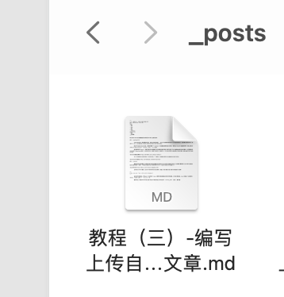
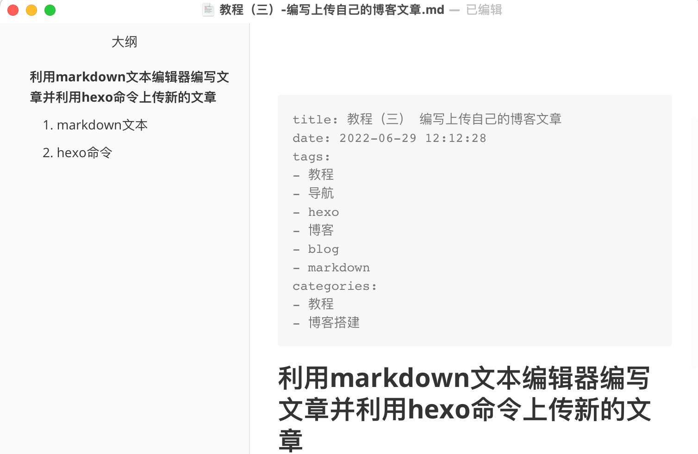

## 利用markdown文本编辑器编写文章并利用hexo命令上传新的文章

### 1. markdown文本

**Markdown是**一种轻量级标记语言，创始人为約翰·格魯伯。 它允许人们使用易读易写的纯**文本**格式编写文档，然后转换成有效的XHTML（或者HTML）文档。 这种语言吸收了很多在电子邮件中已有的纯**文本**标记的特性。

知道了什么是markdown文本后，首先我们需要一个`markdown`文本编辑器用来编写自己的文章，现在的markdown文本编辑器有很多，使用人数比较多的有以下几种MarkdownPad， BookPad，小书匠， typora等等。

我选择使用的是`typora`，但是其实使用文本编辑器不同不会影响我们编写博客，甚至不使用专门的文本编辑器也能很好的编写博客。我们需要在编写文本之前学习一点markdown语法，有一定的学习成本，但是学习成本不高，收益却不小，对于以后日常写作以及编写技术文档也有帮助，具体的编写方法可以参考如下链接：

[markdown基础语法教程](https://markdown.com.cn/basic-syntax/)

至于文本编辑器大部分都是免费的，我这里只提供一个下载链接，如果需要使用其他文本编辑器请自行搜索下载地址：

[markdownpad下载地址](http://markdownpad.com/download.html)

### 2. hexo命令

要编博文我们首先需要在hexo框架中储存文章的位置创建对应文章的markdown类型文件储存我们的文章，这时候我们需要用到一些hexo命令来完成创建文章或是草稿这样一些操作，下面的官方链接可以让你了解常用的hexo命令，并且告诉你这些命令的功能是什么：

[hexo命令文档](https://hexo.io/zh-cn/docs/commands.html)

当然我们也不可以不看文档，因为hexo的常用命令很少也很简单，很重复，我们只需要下面几句就可以做到编写一篇文章：

```text
$ hexo new post "post title with whitespace"

```

该语句的作用是创建一个新的post，默认情况下，Hexo 会使用文章的标题来决定文章文件的路径。对于独立页面来说，Hexo 会创建一个以标题为名字的目录，并在目录中放置一个 `index.md` 文件。

使用命令后，命名的markdown文本会以`“命名.md”`的形式存在于hexo目录下`source/_posts`目录下，例如下图：



这时候我们就可以按照路径打开文件夹编辑我们的文章了，注意内容需在标签页下方，如图所示：



编写完成文章后，我们只需要依次执行下述三条命令，我们的文章就上传完成啦：

```text
 hexo clean   #清除缓存文件 db.json 和已生成的静态文件 public
 hexo g       #生成网站静态文件到默认设置的 public 文件夹(hexo generate 的缩写)
 hexo d       #自动生成网站静态文件，并部署到设定的仓库(hexo deploy 的缩写)

```

当然，如果不放心你还可以使用以下命令，在4000端口调试自己的静态网页：

```text
hexo s

```

完成上述过程，我们就可以在我们的博客上看到我们的文章啦。


### 3. 如果发现文章中的图片无法加载怎么办

markdown文本中的图片是以路径或是链接的形式呈现的，所以第一次使用markdown文本并且移动到不同的目录下，相关的相对路径都可能失效，就出现了图片加载失败的问题，要解决这样的问题我们可以参考下面的教程：

[如何解决博客中图片加载失败问题](/blog/教程（四）-解决博客文章中图片上传失败问题/)

现在你已经是是一个成熟的博主了，开始输出自己的知识与文章吧！
