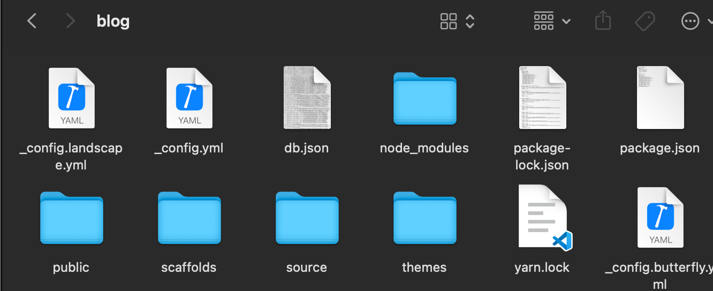
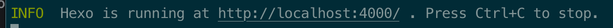
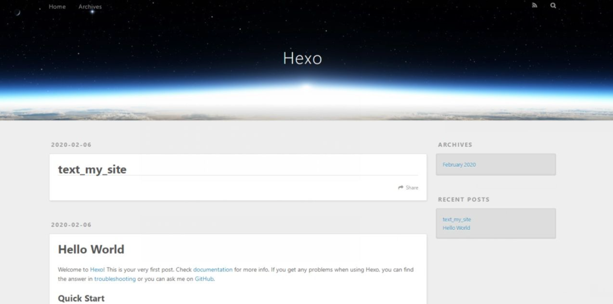
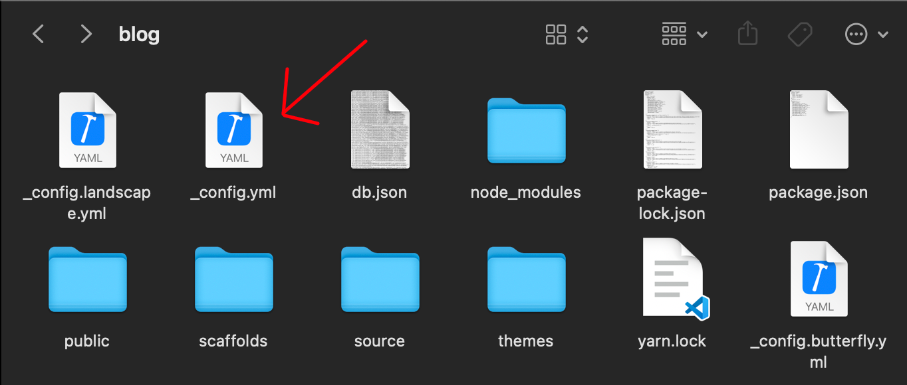
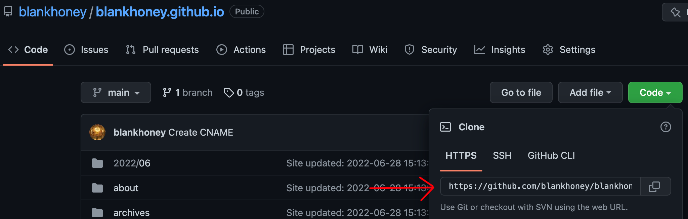
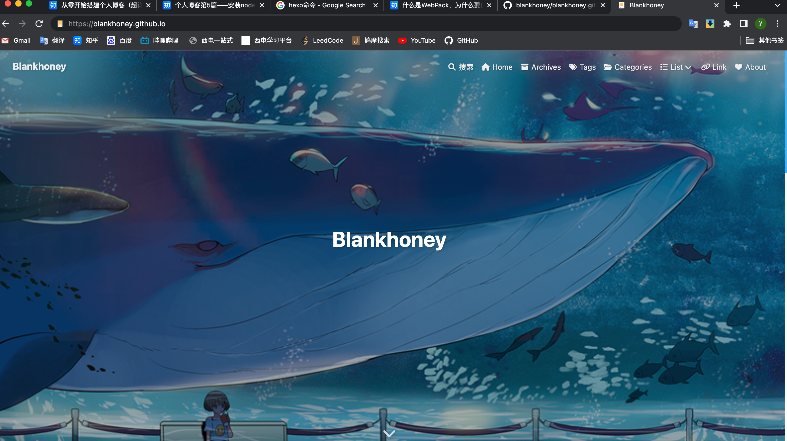

## 部署配置hexo

### 1.从哪下载安装hexo

使用hexo框架我们需要node.js，那么什么事node.js呢。

我们要是不想浏览器事必躬亲，那就**把活扔给服务器干**；当服务器一下子服务很多浏览器时就**不能认死理非要串行操作，**要灵活统筹，**同时开始几件事，哪件完事关闭哪件。**

这三个特征用江湖切口说就叫：

- **服务器端JavaScript处理：**server-side JavaScript execution
- **非阻断/异步I/O**：non-blocking or asynchronous I/O
- **事件驱动**：Event-driven

`Node.js`就是这样一个服务器端的、非阻断式I/O的、事件驱动的`JavaScript`运行环境，重要的是，他是开源的。

首先我们需要安装`node.js`，可以参考以下教程：

[安装node.js教程](https://www.runoob.com/nodejs/nodejs-install-setup.html)

上述菜鸟教程中除了`node.js`的安装教程意外还有`node.js`的介绍以及其常用开发功能介绍，有兴趣的小伙伴可以自行了解

安装完成`node.js`以后我们怎么使用它呢，这里就要提到其独特的安装包管理软件`npm`了。

NPM是随同NodeJS一起安装的包管理工具，能解决NodeJS代码部署上的很多问题，常见的使用场景有以下几种：

- 允许用户从NPM服务器下载别人编写的第三方包到本地使用。
- 允许用户从NPM服务器下载并安装别人编写的命令行程序到本地使用。
- 允许用户将自己编写的包或命令行程序上传到NPM服务器供别人使用。

部署hexo框架就需要用到npm来下载hexo的第三方安装包，这将会节约我们大量的时间。

### 2.怎么下载hexo

首先我们需要在终端（或者说是cmd命令下执行也行）执行命令安装`webpack`：

```text
npm install webpack -g

```

WebPack可以看做是**模块打包机**：它做的事情是，分析你的项目结构，找到`JavaScript`模块以及其它的一些浏览器不能直接运行的拓展语言（`Scss`，`TypeScript`等），并将其打包为合适的格式以供浏览器使用。

安装完成后我们进入到我们选择好的git仓库，与github创建好`github pages`关联的仓库，**准备一个空的文件夹**，可以命名为`blog`或者任何你喜欢的名称，在终端中进入该目录下进行以下操作：

输入命令下载hexo，并进行初始化

```text
npm install -g hexo-cli
hexo init

```

我选择的文件夹命名为`blog`，在目录下运行上述命令后，文件夹中应该有下图中除了主题配置文件_config.butterfly.yml之外的的所有文件



如果你也看到相同画面，恭喜你，你的hexo已经部署在你的主机上了，此时我们只需要稍微配置hexo，就可以开始运行我们的博客网站了。

### 3. 部署并配置运行我们的博客网站

接下来我们继续在终端的该目录下输入以下命令：

首先是静态部署命令

```text
hexo g

```

其次是启动本地服务器命令，该命令也可以用于后期调试使用：

```text
hexo s

```

接下来我们的终端应该会提示以下信息：



提示该信息证明服务器启动成功，我们可以通过端口号为`4000`的端口访问我们的静态网页，在浏览器输入 `http://localhost:4000/`，进入该网页后我们可以看到如下画面：



此时我们的博客其实已经设置好了，已经可以在本地使用了，现在我们要做的是将我们的hexo部署到我们的github上去。

首先我们需要找到位于hexo框架目录下的配置文件 _config.yml：



打开文件，我们将文件底部的信息补充完整：

```text
deploy:
  type: git
  repository: https://github.com/blankhoney/blankhoney.github.io.git  #你的仓库地址
  branch: main

```

**这里注意，github的主分支之前已经修改为`main`，如果继续使用`master`可能会在接下来的步骤中报错。**

其中我们需要填写的仓库地址位于github仓库的下述位置：



配置文件修改完成后，我们下载`git`部署插件，终端根目录（hexo框架目录，以后简称根目录）下运行下述命令：

```text
npm install hexo-deployer-git --save

```

安装成功后依次输入下述命令：

```text
hexo clean   #清除缓存文件 db.json 和已生成的静态文件 public
hexo g       #生成网站静态文件到默认设置的 public 文件夹(hexo generate 的缩写)
hexo d       #自动生成网站静态文件，并部署到设定的仓库(hexo deploy 的缩写)

```

如无报错，部署成功，报错请查看报错位置以及报错信息修改错误。

此项操作完成后，打开浏览器，输入 [https://xxx.github.io](https://link.zhihu.com/?target=https://fengye97.github.io/) 就可以打开你的网页了：



当然我这个是配置完成主题后才会拥有的画面，你会看到的依然是最初的博客画面，但是这也意味着你的博客部署已经成功，现在你已经可以开始编写上传你的博客了，当然如果你需要美化自己的博客的话，可以参考我的下一个教程。


我使用的butterfly主题博客美化教程的官方链接如下：

[博客主题美化butterfly](https://butterfly.js.org/posts/21cfbf15/)
