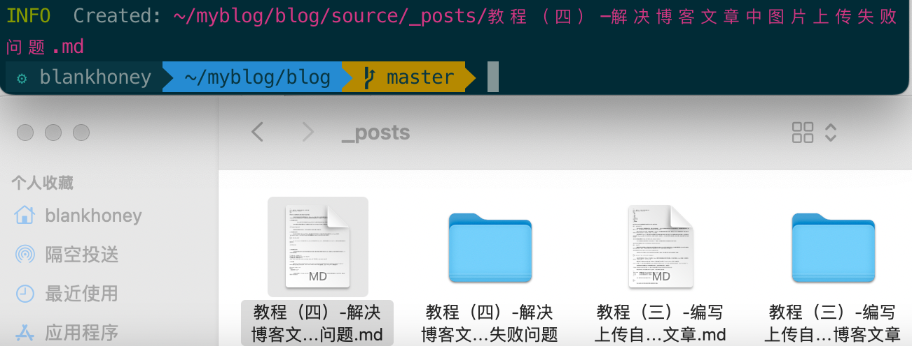

## 为什么文章里的图片会丢

早期写 Hexo 文章时，最容易遇到的问题不是“图片上传失败”，而是静态站点生成后，浏览器找不到图片。

Markdown 里的图片语法本质上只是一条路径引用：

```markdown

```

它不会把图片嵌入到文章文件里，也不会自动帮你把本地图片搬到最终站点目录。最终能不能显示，取决于三件事：

- 图片文件有没有被放进 Hexo 会发布的目录；
- Markdown 或 Hexo 标签里写的路径是否对应最终 URL；
- 首页、归档页、文章页这些不同页面是否都能解析同一个图片路径。

## 方案一：把图片放到全站 images 目录

如果图片是站点通用素材，或者一篇文章里只需要少量图片，可以放在 Hexo 项目的：

```text
source/images
```

文章里使用从站点根目录开始的路径：

```markdown

```

这样生成静态文件后，图片通常会出现在 `/images/image.jpg`。它的优点是简单，首页和文章页都容易访问；缺点也明显：图片和文章没有绑定关系，文章多起来以后，`source/images` 很容易变成一个难维护的素材堆。

## 方案二：为每篇文章使用独立资源目录

如果图片只服务于某一篇文章，更适合使用 Hexo 的文章资源目录。先在站点配置文件 `_config.yml` 中开启：

```yaml
post_asset_folder: true
```

然后创建文章：

```bash
hexo new post_name
```

Hexo 会在 `source/_posts` 下同时生成文章文件和同名资源目录：

```text
source/_posts/post_name.md
source/_posts/post_name/
```

把图片放进这个同名目录后，文章中可以写相对路径：

```markdown

```

源文里的截图展示的就是这种结构：左侧是 Markdown 文章，右侧是和文章同名的图片资源文件夹。



这种方式更适合长期维护，因为文章和配图可以一起移动、一起归档，不容易忘记某张图片属于哪篇文章。

## 方案三：用 Hexo 标签插件处理资源图片

普通相对路径在文章详情页通常没问题，但在首页摘要、归档页等列表页面里，当前 URL 层级变了，图片就可能解析失败。

Hexo 提供了资源图片标签，适合引用文章资源目录里的本地图片：

```text

```

如果引用的是网络图片，并且需要控制显示尺寸，可以使用 `img` 标签插件：

```text

```

这里要区分两件事：`asset_img` 面向文章资源目录里的本地图片；`img` 更像是通用图片标签，可以写外部 URL 和尺寸参数。不要把它们都当成 Markdown 图片语法的简单替代品。

## 方案四：让 Markdown 图片路径适配文章资源目录

如果你更想继续写标准 Markdown，而不是在正文里混用 Hexo 标签，可以让 `hexo-renderer-marked` 参与图片路径处理。

先确认项目使用了这个渲染器：

```bash
npm install hexo-renderer-marked
```

再在 `_config.yml` 中配置：

```yaml
post_asset_folder: true
marked:
  prependRoot: true
  postAsset: true
```

这组配置的作用是让渲染器在处理 Markdown 图片时，把文章里的相对图片路径解析到对应的文章资源目录。也就是说，你仍然可以写：

```markdown

```

但前提是图片已经放在该文章的同名资源文件夹里。资源目录通常由 `post_asset_folder: true` 配合 `hexo new` 创建；渲染器负责解析路径，不负责凭空创建或补齐图片文件。

## 注意事项

选择哪种方式，取决于图片的归属关系：

- 全站共用图片，放到 `source/images`，使用 `/images/...` 引用；
- 单篇文章专属图片，放到文章同名资源目录；
- 希望在首页、归档页和文章页都稳定显示，优先考虑 Hexo 的资源标签或正确配置 `hexo-renderer-marked`；
- 文件名尽量使用英文、小写和短横线，减少 URL 编码、空格和大小写带来的路径问题。

如果本地 Markdown 编辑器里看不到 ``，但 Hexo 生成后的文章页能显示，不一定是错误。因为编辑器只按当前文件系统路径预览，而 Hexo 会在构建时根据文章资源目录重新处理路径。真正需要检查的是生成后的页面 URL 是否能访问到图片。
